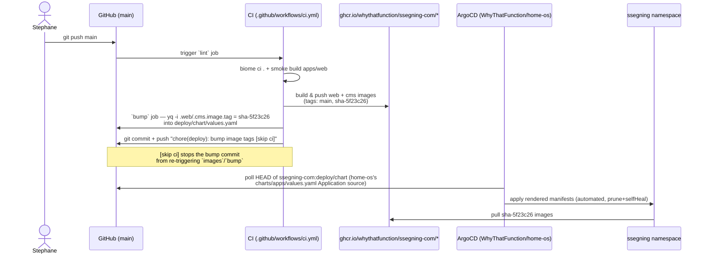

# ssegning-com

The source for [ssegning.com](https://ssegning.com) — a solo software &
platform engineering consultancy site. pnpm monorepo:

| Path | What it is |
|---|---|
| `apps/cms` | Strapi 5 CMS (content, admin panel, REST API) |
| `apps/web` | Next.js 16 site (App Router, reads the CMS over REST) |
| `deploy/chart` | The Helm chart ArgoCD syncs onto the cluster |

See `CONTRACT.md` for the detailed content model and env-var contract
between the two apps, `apps/web/DESIGN.md` for the visual design record, and
`apps/web/README.md` / `apps/cms/README.md` / `deploy/chart/README.md` for
per-directory detail.

## Live URLs

| Host | Behavior |
|---|---|
| `https://ssegning.com` | The site (Next.js), canonical/apex |
| `https://cms.ssegning.com` | Strapi admin panel + public REST API |
| `https://www.ssegning.com` | 301 → `https://ssegning.com` |
| `https://god.ssegning.com` | 301 → `https://ssegning.com` |
| `https://apps.ssegning.com` | 301 → `https://ssegning.com` |
| `https://blog.ssegning.com/<slug>` | 301 → `https://ssegning.com/journal/<slug>` (slug-preserving) |

`ssegning.com` and `*.ssegning.com` are Cloudflare-proxied CNAMEs to this
site's own dynamic-DNS hostname, which resolves to the home cluster's
Traefik — so DNS already answers for any subdomain under the wildcard and
adding one needs no Cloudflare change. TLS does **not** follow the same
shortcut, though: `deploy/chart`'s `Certificate` lists explicit `dnsNames`
rather than requesting a wildcard SAN (see `deploy/chart/values.yaml`), so a
new subdomain still needs its hostname added there plus an `Ingress`/
redirect entry before cert-manager will issue for it.

## How a change reaches production

Pushing to `main` is the entire deploy trigger — there is no separate
"promote" step and no manual `kubectl apply`.



The ArgoCD `Application` itself (`name: ssegning-com`) lives in
`WhyThatFunction/home-os`'s `charts/apps/values.yaml`, not in this repo — it
points `targetRevision: HEAD` at `path: deploy/chart` here. That split is
deliberate: `home-os`'s `main` is PR-only behind a governance check, so
nothing there can write a promoted image digest back into it; this repo's
own CI pushes straight to its own `main`, which is what lets the `bump` job
work at all.

## Local development

```bash
pnpm install

# Throwaway Postgres for the CMS
docker run --rm -e POSTGRES_USER=strapi -e POSTGRES_PASSWORD=strapi \
  -e POSTGRES_DB=strapi -p 5432:5432 postgres:16

# CMS — copy apps/cms/.env.example to apps/cms/.env first
pnpm --filter @ssegning/cms develop

# Web — copy apps/web/.env.example to apps/web/.env.local first,
# STRAPI_URL=http://localhost:1337
pnpm --filter @ssegning/web dev
```

`apps/web` renders fully with the CMS down or unreachable — every Strapi
fetch in `apps/web/src/lib/strapi.ts` fails soft to `null`/`[]`, and pages
fall back to the hand-written copy in `apps/web/src/content/fallback.ts`.
This is deliberate: a cold cluster, a CMS restart, or a plain `STRAPI_URL`-
less dev box must never show a 500 — you can develop and preview the whole
site with no CMS running at all.

## Content model

Single types (`site-setting`, `home-page`, `about-page`, `contact-page`,
`legal-page`) and collection types (`service`, `project`, `post`) — full
field-level schema in `CONTRACT.md`.

The 12 journal articles are not authored in Strapi — they're bundled
Markdown in `apps/cms/src/bootstrap/articles/`, imported into the `post`
collection on every boot by `apps/cms/src/bootstrap/articles.ts`. The
importer only **creates** a post when no `post` with that slug exists yet;
it never updates one. So editing a published post's title, body, or excerpt
in the Strapi admin sticks — the next pod restart will not revert it, since
the importer's create-if-absent check already finds the slug.

Editors can also opt any new field into a Tiptap rich-text editor
(`@notum-cz/strapi-plugin-tiptap-editor`, registered in
`apps/cms/config/plugins.ts` with `article` and `minimal` presets). This
adds a "Rich Text (Tiptap)" field type to the Content-Type Builder
alongside Strapi's built-in `richtext` — it does not replace it, so
`post.body` and every other existing schema field is untouched, and none
of the bundled bootstrap articles were migrated.

## Gotchas

Each of these cost real production debugging time. Verified against the
current code as of this writing (2026-09-04) — if you find one that no
longer holds, fix this table, don't just work around it.

| Gotcha | Why it matters |
|---|---|
| The four `GISCUS_*` vars are deliberately **not** `NEXT_PUBLIC_*`. | `NEXT_PUBLIC_*` is inlined at **build** time, and the Docker image is built in CI with no giscus config — a `NEXT_PUBLIC_GISCUS_*` would bake in as `undefined` forever. `apps/web/src/app/journal/[slug]/page.tsx` (a Server Component) reads `process.env.GISCUS_*` at **request** time and passes the values as props into `apps/web/src/components/comments.tsx`, so a Deployment env change takes effect on the next pod restart with no rebuild. Renaming these back to `NEXT_PUBLIC_*` silently disables comments forever. |
| Every content route carries an explicit `export const revalidate = 60`. | The Strapi fetch helpers in `apps/web/src/lib/strapi.ts` fail soft (return `null`/`[]`), so a build performed with Strapi unreachable — which is every Docker build, since CI has no Strapi to talk to — records nothing revalidatable. Without the route-level `revalidate` export, Next has no other signal and bakes the route as **permanently static**, serving fallback copy forever even once the CMS is reachable in production. |
| `strapi build` only transpiles `src/**/*.ts`. | It does not copy the bundled article Markdown under `src/bootstrap/articles/`, which `articles.ts` reads via `readFileSync` at runtime. `apps/cms/scripts/copy-bootstrap-assets.js` copies that directory into `dist/` after every build; skip it and the CMS `ENOENT`s reading a bundled article at boot. |
| Strapi 5's Document Service overrides `publishedAt` on `create()`. | It always stamps "now", ignoring any `publishedAt` passed in — so `articles.ts` backdates each post's release date via a follow-up `strapi.db.query('api::post.post').update(...)` (the low-level query layer, which has no such override) to reproduce the intended one-week-apart release order under `GET /api/posts?sort=publishedAt:desc`. |
| `apps/web/public` must contain a tracked file. | An empty, untracked `public/` directory passes a local build (pnpm/git don't care) but fails every CI build from a clean clone, since Docker's build context only sees what git tracks. `.gitkeep` + a `README.md` are committed there for exactly this reason — don't let both get deleted. |
| `pnpm-workspace.yaml` carries `minimumReleaseAgeExclude` and an `@types/react` `overrides`. | pnpm 11's `minimumReleaseAge` guard refuses to resolve any package published in the last 24h — which fires on every `--frozen-lockfile` install inside a Docker build — so newly-adopted versions (Next.js 16.3.4 and its per-platform binaries, `lucide-react` 1.38.0) need an explicit, temporary allowlist entry until they age out. Separately, Strapi's admin dependency tree pulls `@types/react@18` as a transitive peer while `apps/web` is on React 19; two copies of `@types/react` in one workspace make `ReactNode` non-assignable to itself, breaking `next build`'s type check — the `overrides` block collapses both to the React 19 version. |
| `EMAIL_DEFAULT_FROM` must stay inside the mail relay's `ALLOWED_SENDER_DOMAINS`. | The in-cluster postfix relay (`mail-system` namespace) enforces an explicit sender-domain allow-list; a `From` address outside it is a hard rejection at submission time, not a soft bounce later. Changing `EMAIL_DEFAULT_FROM`/`emailDefaultFrom` needs the relay's own config updated first, or outbound mail (and the derived Apprise `mailto://` alert URL, which reuses the same value) breaks immediately. |
| `@notum-cz/strapi-plugin-tiptap-editor` pins its `@strapi/strapi` peer to the exact string `5.39.0`. | This repo runs `5.52.2`. pnpm only warns rather than failing, since this repo doesn't set `strict-peer-dependencies` — a real `strapi build` succeeds and the plugin's admin bundle lands in `dist/build/` as verified, but a stricter install elsewhere (a fresh `--frozen-lockfile` with peer strictness on) could fail on this mismatch. Upstream issue #27 / PR #34 track loosening the pin. |
| The SASL username sent to the mail relay must be qualified as `user@localdomain`, not sent bare. | Diagnosed empirically post-deploy from a live `535 5.7.8 authentication failed`: the relay has `mydomain=localdomain` and an EMPTY `smtpd_sasl_local_domain`, so its Cyrus sasldb entry is literally `user@localdomain` — a bare username instead resolves against `myhostname` (`mail-0`) and never matches. Confirmed against the live relay: bare username failed 535, `user@localdomain` authenticated OK, `user@mail-0` failed 535. Fixed by `qualifySaslUser` in `apps/cms/src/lib/smtp-credentials.ts`, driven by `SMTP_SASL_REALM`/`cms.env.smtpSaslRealm`. This value must track the relay's own config, not this repo's — see the comment on `smtpSaslRealm` in `deploy/chart/values.yaml`. |

## Operations

| Concern | Detail |
|---|---|
| Secrets | AWS Secrets Manager `ssegning/prod/env`, synced in via the `ssegning-aws` `ClusterSecretStore` (external-secrets). One mapping is the exception: `SMTP_SASL_USERS` sets its own `remoteKey: prod/meta/test-app` to read the shared infra secret the mail relay itself is configured from (the same one `imagePullSecret` already uses), so rotating that credential keeps relay and client in sync. See `deploy/chart/README.md` for the full property → env-var mapping. |
| Outbound email | Strapi (`@strapi/provider-email-nodemailer`, `apps/cms/config/plugins.ts`) → in-cluster postfix relay `mail.mail-system.svc.cluster.local:587` (SASL-authenticated, **TLS disabled on this hop**: the relay's cert is self-signed `CN=localhost` and unverifiable, the traffic never leaves the cluster, and the relay sets `smtpd_tls_auth_only = no`) → that relay's own upstream smart host. `EMAIL_DEFAULT_FROM` must stay inside the relay's `ALLOWED_SENDER_DOMAINS` (see Gotchas). |
| Alerting | `apps/cms/src/lib/apprise.ts` posts a `success`/`failure` notification on every CMS `bootstrap()` to the stateless in-cluster Apprise at `apprise.notification-system.svc.cluster.local:8000` — a deploy heartbeat either way. Apprise has no persistent config, so target URLs go per-request: by default a `mailto://` derived from the same SMTP credentials, or `APPRISE_ALERT_URLS` verbatim if set, the swap point for moving alerts to Slack/Telegram/etc. with no code change. Never throws or blocks boot; times out after 5s. |
| Media uploads | MinIO bucket `ssegning-uploads`, world-readable by design (anonymous `s3:GetObject`) since the site serves images straight out of it. |
| Postgres backups | barman-cloud to the **private** `ssegning-cnpg-backups` bucket (a separate bucket from uploads, deliberately not in the anonymous-read policy) — nightly `ScheduledBackup` at 03:00 plus continuous WAL archiving. |
| Comments | One manual step left: install the [giscus GitHub App](https://github.com/apps/giscus) on `WhyThatFunction/ssegning-com`. Until then the widget renders but reports "giscus is not installed on this repository"; the page degrades cleanly either way. |
