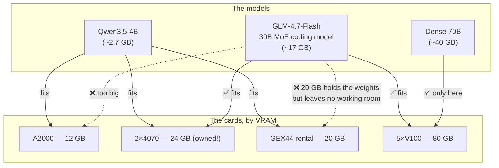
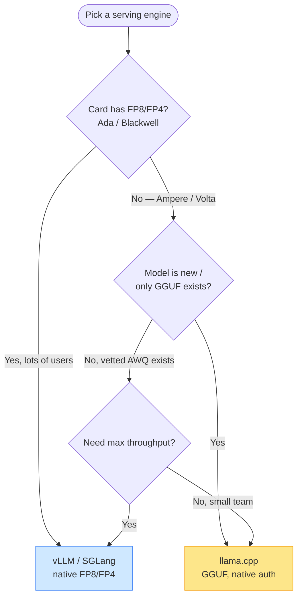
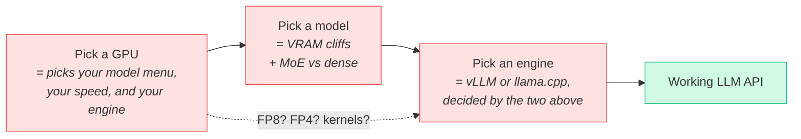

# GPU + vLLM and you're done?

> **What everyone "knows":** *self-hosting an LLM is easy. Rent a GPU, run vLLM, point
> your app at it. Done.*
>
> **What actually happens:** the GPU you pick silently decides which models you can run,
> how fast, and whether vLLM even works. "Which GPU" and "which model" turn out to be the
> same question wearing two hats — and vLLM isn't always invited.

*Part of a little series for people watching AI eat everything and trying to tell the hype
from the homework. This one is the homework nobody hands you before you swipe the card.*

---

## The picture in everyone's head

It feels like installing a database. Three interchangeable LEGO bricks. Snap, snap, snap,
ship.

The catch: none of these three bricks is a free choice. Each one quietly handcuffs the
next. Here's what those innocent little arrows are hiding.

---

## Trap 1 — the GPU's *generation* decides what math it can do fast

People shop for GPUs by two numbers: **VRAM** (does the model fit?) and **price** (ouch).
Both matter. But there's a third axis nobody puts on the comparison table: **which number
formats the chip can multiply quickly** — and that's set by the silicon's birth year.

Modern models ship *quantized* — squeezed from 16 bits per weight down to 8 or 4 to save
memory and run faster. But a GPU only runs a given format *fast* if it has hardware for it,
and older chips simply don't:

| GPU generation | Example card | FP8? | FP4? | Stuck with |
|---|---|---|---|---|
| Volta (2017) | Tesla V100 | ❌ | ❌ | FP16 / 4-bit, **no fast kernels** |
| Ampere (2020) | RTX A2000 | ❌ | ❌ | INT4 / GGUF |
| Ada (2022) | RTX 4070 | ✅ | ❌ | FP8 (fast, near-lossless) |
| Blackwell (2024) | RTX PRO 6000 | ✅ | ✅ | FP4 — fast *and* tiny |

This is not a footnote. **FP8 is the efficiency path most "just run vLLM" guides quietly
assume** — and an Ampere or Volta card has *no FP8 hardware whatsoever.* Switch it on and you
don't get "a little slower," you get an error mid-request. Same 4-bit model that flies on a
Blackwell card crawls on a Volta one, because Volta has none of the modern 4-bit kernels and
limps along on a fallback path.

Same dense-70B model, two cards:

- **Blackwell:** ~60–100 tokens/sec. Reads like a person typing fast.
- **Volta:** ~20–30 tokens/sec. Reads like a person typing while thinking about their taxes.

Same model. Both "fit in VRAM." A 3× speed gap that no price-vs-VRAM chart would ever warn
you about.

> 🤓 *Nerds, this part's for you:* the formats are FP8/FP4/INT4-AWQ/GGUF, and the magic word
> is **kernels** — the hand-tuned routines (Marlin, AWQ, FlashAttention) that make a given
> quant fast. They require Ampere-or-newer (4-bit) or Ada-or-newer (FP8). Volta predates all
> of them, so it's correct *and* slow — the worst combination, because nothing errors, it
> just sighs.

**The reframe:** you don't pick a GPU and *then* pick a model. The GPU's generation already
shrank your model menu and capped your speed before you opened a single model card.

---

## Trap 2 — "which model" is a VRAM cliff, not a slope

Second surprise: the most interesting open models of 2026 are **Mixture-of-Experts (MoE)**,
and they cheerfully break the tidy "bigger model = bigger GPU" intuition.

A MoE model might have 30 billion parameters total but only *wake up* ~3 billion per token.
So:

- **Speed** follows the *active* params → a 30B MoE generates about as fast as a 3–6B model.
  Cheap.
- **VRAM** follows the *total* params → all 30B still has to sit in memory. Not cheap.

"Small and fast" and "needs a big card" — at the same time. Here are three real models
against four real setups:

Look at **GLM-4.7-Flash**, a 30B MoE built for coding. The €184/month **rented GEX44** (20
GB) *can't run it* — 20 GB fits the weights but leaves no room for the per-request working
memory (the "KV cache"). Meanwhile a pair of **gaming RTX 4070s you already own** (24 GB
total) runs it without complaint.

So the "serious" managed rental is *worse at the flagship coding model* than two cards from a
gamer's leftovers. Four gigabytes is the entire difference between "runs the good model" and
"stuck with the toys." VRAM is a cliff, and the drop is steep.

---

## Trap 3 — vLLM is a choice, not a law of physics

Now the part the tutorials fumble hardest. vLLM is genuinely excellent. It is also **not
always the right tool**, and sometimes it just… won't run your model.

When a brand-new architecture drops (these arrive roughly monthly now), vLLM support is often
turbulent for weeks: the model breaks on a version bump, the multimodal variant says "not
supported for now," there's no text-only class yet. And if your card is Ampere/Volta (no
FP8), vLLM's fast lane is closed to you, so it falls back to a **slow GGUF loader** —
measured at ~93 tokens/sec where the proper kernel does ~741. That's an ~8× tax for using
the wrong loader for the format.

The alternative, **llama.cpp**, is built *around* that 4-bit GGUF format. On an owned card,
for a small model, it gives comparable real-world speed (~52 tok/s measured), native API-key
auth, a one-container deployment, and — crucially — it was *already running the new model*
while vLLM was still in the changelog mines.

So the real decision tree looks nothing like "run vLLM":

vLLM wins when you've got modern silicon and a crowd to serve. llama.cpp wins for
owned/older cards, fresh architectures, and small teams. **Neither is the default.** The
engine falls out of the card and the model — same plot twist as everything above.

---

## The same three bricks, drawn honestly

Three bricks, three loaded decisions, all wired together.

## Yes, but — why not just use the cloud and skip all this?

The fair objection: *who cares which GPU?* Call a managed inference API and you never pick a
chip, a quant, or an engine in your life — and for most teams, most of the time, that's the right
call. "It's simple" becomes *true* the second someone else holds the hardware.

But the coupling doesn't vanish, it gets **relabeled**: the GPU generation you skipped is baked
into the provider's $/token; the VRAM cliff is now a context limit and a rate cap; the engine you
didn't choose is why one host streams at 60 tok/s and another at 20 for "the same" model. You're
still placing all three bets — with a credit card instead of a screwdriver, plus a new one:
lock-in, at someone else's margin. **Self-hosting forces you to see the coupling; the cloud hides
it in the bill. Neither deletes it — so pick the currency you'd rather pay in: understanding, or
margin and lock-in.**

## The takeaways

1. **Buy the silicon generation, not just the gigabytes.** FP8/FP4 support sets your speed
   and which efficiency paths even exist. Ampere/Volta have none of it.
2. **VRAM is a cliff.** Four gigabytes can be the line between the flagship model and a toy.
   Budget for weights *plus* working memory.
3. **MoE breaks your gut feeling.** A 30B MoE is "small and fast" and "needs a big card"
   simultaneously. Make peace with that.
4. **vLLM is a choice.** For owned/older cards and fresh models, llama.cpp is often the one
   that actually boots — and an ~8× difference hides in the GGUF-loader mismatch.

The honest one-liner: *"get a GPU and run vLLM"* is three independent bets cosplaying as one
easy step. Place them on purpose, not on vibes.

---

*Next: [I almost bought five V100s →](02-i-almost-bought-five-v100s.md) — same hardware,
but now it's buy-vs-rent, and the answer is hiding in your electricity bill.*
