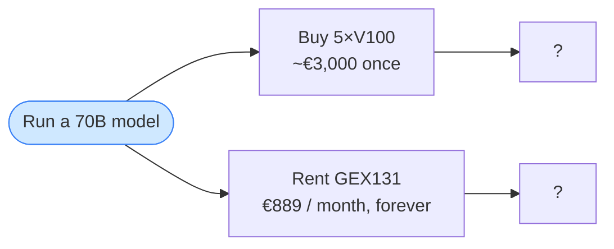
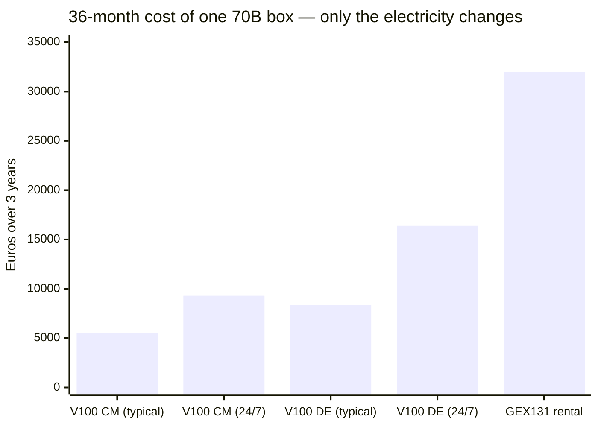
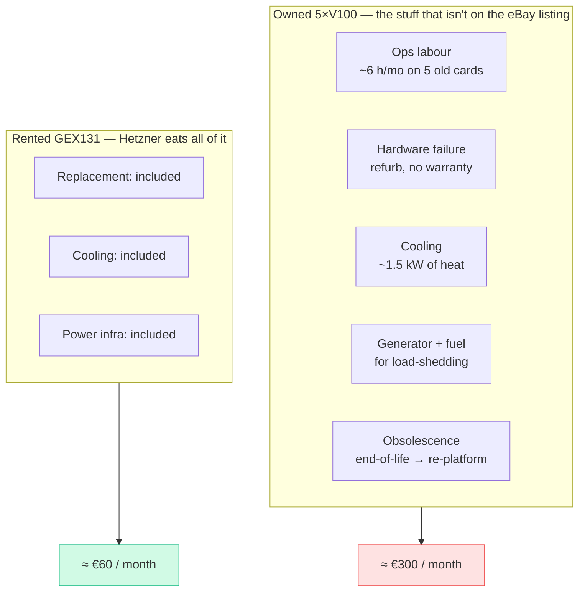
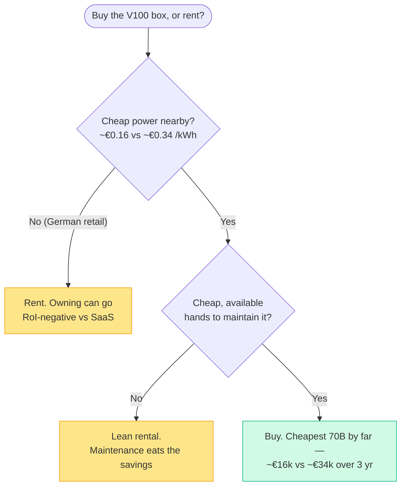

# I almost bought five V100s

> **What everyone "knows":** *renting cloud GPUs is a money pit. Buy the hardware once
> and after that it's basically free — just the electricity.*
>
> **What actually happened:** owning *can* be 6× cheaper… or it can lose money against
> the very SaaS you were trying to escape. The deciding number isn't the price tag. It's
> your electricity bill and a line item nobody ever writes down.

*Part of a little series for people watching AI eat everything around them and quietly
wondering what's hype and what's real. This one's about money, which tends to cut
through hype faster than anything.*

---

## The setup (a.k.a. how I got excited)

I found a refurbished server on eBay: **five Tesla V100 GPUs, 80 GB of VRAM total.**
Enough to run a 70-billion-parameter model — the kind you normally rent for Real Money.
The rental equivalent, a **Hetzner GEX131** dedicated GPU box, is **€889/month.** Every
month. Forever. Until the heat death of the universe or your startup, whichever comes first.
(Hold onto that word — *forever*. It has a shorter shelf life than you'd think.)

The owned box looked like a no-brainer. Pay ~€3,000 once, then it's "free." I had the
tab open. I had the *feeling*. You know the feeling.

Let me walk you through how that no-brainer survived contact with a spreadsheet. Spoiler:
it didn't, but it died in an interesting way.

---

## Round 1 — the napkin math (owning wins, obviously)

Cash out the door over three years:

- **Owned:** €3,000 + electricity.
- **Rented:** €889 × 36 = **€32,004.**

Even with a generous power bill, the owned box lands near **€12,000** over three years
vs **€32,000** rented. The break-even purchase price — where buying would cost the same
as renting — is about **€23,000.** The box costs three grand.

Owning wins by a country mile. Belief confirmed, close the laptop, buy the thing.

And this is exactly where most people stop. It's also exactly where two ignored numbers
walk in and flip the table.

---

## Round 2 — your electricity has an address

The V100 box pulls real power — up to ~1.5 kW flat out. And here's the trick about "just
the electricity": **a kilowatt-hour does not cost one fixed price.** It depends on where
the box is plugged in.

- **Germany (retail):** ~€0.34 / kWh
- **Cameroon (where this box would actually live):** ~€0.16 / kWh — less than half.

Same hardware, same purchase price, electricity as the *only* variable:

| Scenario | 3-year cost | vs cheap budget SaaS |
|---|---|---|
| **V100 in Cameroon, typical load** | **€5,520** | saves ~$255/mo → pays for itself in ~13 months ✅ |
| V100 in Cameroon, running 24/7 | €9,300 | still ahead ✅ |
| V100 in Germany, typical load | €8,364 | meh ⚠️ |
| **V100 in Germany, sustained 24/7** | **€16,392** | **loses ~$90/mo — never pays back ❌** |

Read that bottom row twice. In Germany at full tilt, **the power bill alone (~$404/month)
is more than the SaaS it was supposed to replace (~$305/month).** You would literally save
money by doing nothing and calling an API. The "free after you buy it" box is, in this
corner, *actively negative.*

The thing that made owning look brilliant in Round 1 was never the hardware. It was
**cheap power.** Drag the same box 5,000 km north and the genius evaporates.

> 🤓 *Nerds, this part's for you:* the rental looks expensive until you remember Hetzner's
> €889 **includes** power — bought at industrial datacenter rates and hidden inside the
> rent. An owned box pays *retail* power, fully exposed. That tariff delta is most of the
> story; the GPUs are almost a sideshow.

---

## Intermission

So — after all that, you're *still* going for the 5×V100, right? Cheap Cameroon power,
cash-out a third of the rental, own the thing? Honestly, fair. I was too.

Cool. Then let's talk about maintenance.

---

## Round 3 — the line nobody writes down

Even with cheap power, the owned box has a cost the rental simply doesn't: **a human has
to keep it breathing.**

Five refurbished, out-of-warranty cards from 2017. A 1.5 kW space-heater's worth of waste
heat to evacuate. A grid with load-shedding, so now you also own a generator and a fuel
habit. And the chips are on the vendor's end-of-life list, so a forced re-platform is
already scheduled, it just hasn't told you the date. None of that is electricity, and all
of it is real:

Put a conservative ~€300/month on that and re-total the three years:

| Box | Hardware + power only | **+ maintenance** | Fully loaded (3 yr) |
|---|---|---|---|
| **5×V100 (Cameroon)** | €5,520 | + €10,800 | **≈ €16,320** |
| GEX44 (smaller rental) | €6,703 | + €1,440 | ≈ €8,143 |
| GEX131 (70B rental) | €32,004 | + €2,160 | ≈ €34,164 |

**Maintenance roughly triples the owned box** — €5,520 → €16,320 — while the rentals barely
budge, because Hetzner is quietly absorbing hardware, cooling, power infrastructure, and
replacement. That near-zero maintenance line is a huge chunk of what the rental premium
actually buys. You're not overpaying for convenience; you're paying someone else to own the
3 a.m. phone call.

The owned box is *still* cheaper than the €34k rental. But it's no longer the runaway win of
Round 1 — and against the *smaller* rental, once you count the humans, it's now **more**
expensive.

---

## Round 4 — the "forever" price wasn't

But let's not be naive. That whole break-even story — three years to ROI, €889/month *forever* —
only holds in a world where the provider keeps its prices put. That isn't the world we live in, and
I didn't even have to wait for a hypothetical to prove it: **while I was writing this very article,
Hetzner — the popular German cloud provider whose GEX131 anchors every table above — put its prices
up.**

On **15 June 2026**, it repriced the catalogue. The 70B box I'd been comparing against —
restandardised as the **GEX131** — jumped from **€889 to €1,197.30/month** (**+35%**), and the
one-time setup fee went from **€79 to €599.** The smaller GEX44 went €184 → €232.30. Same silicon,
same datacenter, same rack. The only thing that moved was the invoice.

| Rental (new orders, from 15 Jun 2026) | Was | Now | 3-yr |
|---|---|---|---|
| **GEX131** (the 70B box) | €889/mo | **€1,197.30/mo** (+35%) | ≈ **€43,700** |
| GEX44 (smaller) | €184/mo | €232.30/mo (+26%) | ≈ €8,477 |
| Setup fee (GEX131) | €79 once | €599 once | — |

There's a twist that saves your skin and proves the point in the same breath: **the increase hits
only new orders and rescales — existing contracts are grandfathered.** If you'd signed in Round 1,
you still pay €889; your "forever" held. Whoever decides *today* eats the +35%. So the headline
number that made the rental such a clean comparison turned out to have a postcode *and* an expiry
date — fixed for the people already inside, repriced for everyone at the door.

What it does to the verdict is one-directional: it widens owning's money lead and never narrows it.
The fully-loaded owned box (~€16k) now stares down a **~€46k** rental instead of ~€34k. On pure
euros, the hardware case got *stronger* the very week the rental got *pricier* — which sets up the
one thing the spreadsheet still refuses to price.

> 🤓 *Nerds:* this was the fourth pricing action of 2026 (setup fees in February, a portfolio-wide
> monthly bump on 1 April, dedicated setup fees again on 29 April, then the June standardisation),
> all blamed on RAM/NVMe/GPU procurement costs. Note what *wasn't* touched: the Server Auction,
> volumes, snapshots, object storage. The volatility rode in on the *compute*, exactly the part you
> were trying to own your way out of.

---

## The verdict isn't a number. It's a question about you.

Owning the V100 box is the cheapest way to run a 70B model **if and only if** two things
are true: cheap power *and* near-free hands to babysit it. Take away either, and renting
wins. In the worst case — pricey power, full load — owning loses money against the SaaS you
were trying to leave.

## Yes, but — you priced everything except the reason people actually self-host

This whole piece is a money argument, and on money — *especially* after Round 4 — owning the box
looks better than ever. But spot the trap in that sentence: I just let the vendor's pricing decide
my conclusion. The spreadsheet quietly priced at *zero* the things a rented box really costs you:
**control, privacy, data residency, and not being a hostage.** Round 4 *is* the hostage clause,
arriving on schedule — a +35% repricing nobody on the renting side voted for. You were grandfathered
this time. Nothing in the contract promises you will be next time.

So the synthesis lands firmer than "rent vs buy." **Own when the data or the sovereignty *is* the
point** — you'll eat the maintenance gladly, and you'll never wake up to an email that re-prices your
stack. **Rent when it's genuinely just compute — and rent *early*,** because the quoted "forever" is
only forever for whoever already signed. The V100 math says "rent" right up until the workload is the
kind you can't put on someone else's machine, or the price is the kind someone else can move while
you sleep.

## The takeaways (steal these for your own spreadsheet)

1. **"Then it's just electricity" hides two costs:** the electricity has a postcode, and
   *maintenance* — labour, cooling, generators, obsolescence — often dwarfs it.
2. **Your tariff is the swing factor**, not the sticker price. Same box: cheapest option in
   one country, expensive mistake in another.
3. **The rental premium buys away risk** — hardware failure, cooling, power infra, and a
   maintenance bill that silently triples an owned box. That's not fluff; it's the product.
4. **The rental's "€/month forever" is not a constant.** It's fixed for contracts already signed
   and repriced for new ones — Hetzner moved the 70B box +35% in a single notice. Read the headline
   rate as *today's* rate, lock in early, and never build a multi-year plan on a number the vendor
   can change while you sleep.
5. **Run the fully-loaded number before you click buy.** Capex + *your* power rate + *your*
   labour. The eBay listing only tells you the first one.
6. **Cheapest isn't the only axis — and often isn't the deciding one.** The spreadsheet ignores
   control, privacy, and data residency; those, not €/month, are why most people self-host. Price
   the sovereignty, *then* decide.

So here's the honest question that fell out of all my research, and I'll just leave it on
the table: **if it weren't for cheap electricity in Cameroon, who is actually buying that
V100 in Germany?** I genuinely don't have a buyer for that one.

---

*Previous: [← GPU + vLLM and you're done?](01-gpu-plus-vllm-and-youre-done.md) ·
Next: [Just point it at the URL →](03-just-point-it-at-the-url.md) — three bugs in a trench
coat, all pretending to be "just routing."*
