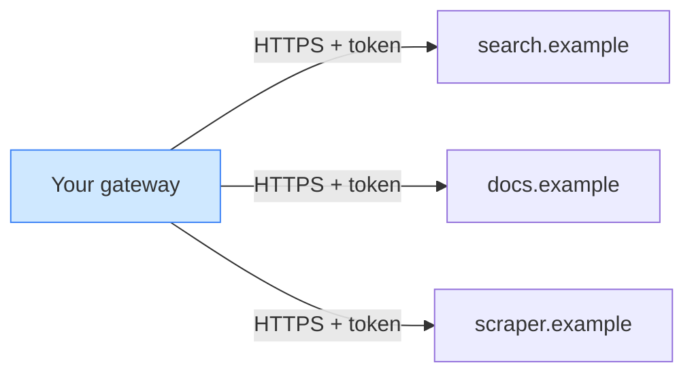
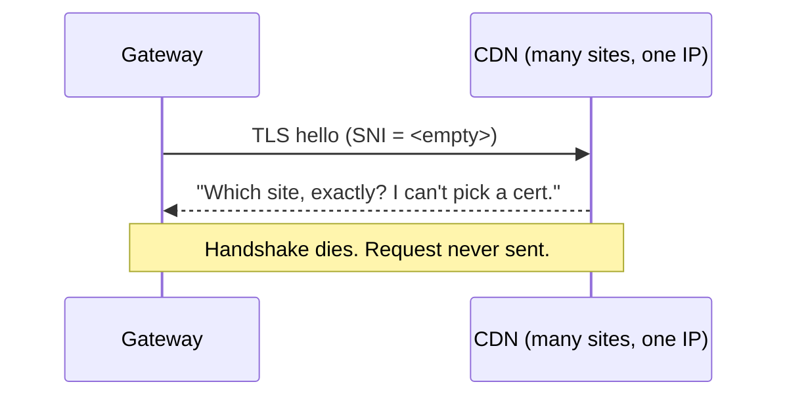
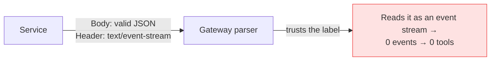
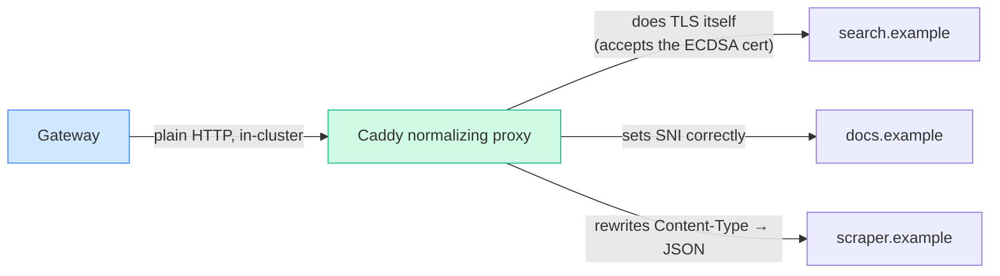

# Just point it at the URL

> **What everyone "knows":** *connecting my gateway to an external service is just routing.
> I have the URL and a token — what could possibly go wrong?*
>
> **What actually happens:** "the network reaches it" is the easy 10%. The other 90% is
> two systems quietly disagreeing about certificates, content types, and protocol framing.
> Three services, three invisible mismatches, none fixable where you'd expect.

*Part of a little series for people watching AI eat everything and wondering why the "simple"
integrations keep catching fire. This one's a whodunit with three suspects and no obvious
murder weapon.*

---

## The plan that should have been a config line

You run a gateway. You want it to talk to three hosted services — say a search tool, a docs
tool, and a scraper. They all speak the same protocol (here, MCP — think "USB-C for AI
tools"). You've got URLs. You've got API keys. The plan:

Same protocol both ends, valid certs, valid tokens. A config line each, tops. Instead, all
three failed — each for a *completely different* reason, and each one initially looked like
somebody else's bug. Let's meet the suspects.

---

## Suspect 1 — the handshake that can't pick a certificate

The first service simply refused to connect. TLS handshake failures, the most
character-building error in computing.

The culprit is a detail nobody thinks about: **SNI** (Server Name Indication). When your
client opens a TLS connection, it's supposed to whisper which hostname it wants — "hi, I'm
here for `docs.example`" — so a server hosting hundreds of sites behind one IP (every CDN
ever) knows which certificate to hand back.

Our gateway whispered… nothing. Empty SNI. The CDN had no idea which certificate to present,
so the whole handshake collapsed before a single byte of the actual request. And the cruel
twist: the usual fix (a TLS policy on the backend) **never reached the layer that builds the
connection.** You could set that hostname until your keyboard wore out; it was ignored.

Token: fine. URL: fine. Route: fine. The connection died one rung *below* all of them, on a
field you never set by hand and probably didn't know existed.

---

## Suspect 2 — a perfectly valid cert the gateway hated on sight

The second service presented a flawless certificate. Signed, in-date, trusted chain. The
gateway rejected it with the magnificently grumpy error **`BAD_ECC_CERT`.**

The cert used **ECDSA** (elliptic-curve) keys — modern, smaller, faster, increasingly the
default. But the gateway's bundled TLS engine, in that particular build, was fussy about a
curve parameter and refused it. A browser would've accepted the same cert without a flicker.

Nothing was wrong with the certificate. The incompatibility lived entirely inside *which TLS
library your gateway happens to ship with* — a thing you rarely choose and almost never think
about until it's 11 p.m.

> 🤓 *Nerds, this part's for you:* the engine was BoringSSL, strict on a specific ECC curve;
> the fix was to terminate TLS in Go's stack instead, which accepts it happily. Two
> standards-compliant TLS implementations, same cert, opposite verdicts. "Valid certificate"
> is not a binary — it's "valid *according to whose stack.*"

---

## Suspect 3 — the right data wearing a fake mustache

The third service connected fine, authenticated fine, and returned… nothing. Zero tools
discovered. No error. The most unsettling outcome there is.

It was sending back perfectly good JSON — but stamped with the header `Content-Type:
text/event-stream`. That header means "this is a live event feed," so the gateway's parser
obediently tried to read JSON as a stream of events, found none, and reported a cheerful,
successful, completely empty result.

The bytes were correct. The label on the envelope was a lie, and the parser believed the
label over its own eyes. A silent, no-error, "everything's fine and also nothing works"
failure — the kind that eats an afternoon.

---

## Why none of them could be fixed "at the URL"

Here's the thread tying the three suspects together: **every failure was two correct-ish
systems disagreeing, one layer below the request itself.** Empty SNI, a picky TLS curve
check, a lying content-type. You can't fix any of them by editing a URL or a token, because
none of them is *about* the URL or the token.

Worse, they couldn't be fixed at the gateway either — its TLS behaviour was baked into the
build, its TLS knobs didn't reach the connection, and it trusted that header by design. So
the move was to stop fighting the gateway and instead **put a small, boring translator in
front of each service** — a plain reverse proxy running inside the cluster:

The little proxy terminates TLS with a different library (so the ECDSA cert is fine), sets
SNI correctly (so the CDN picks a cert), rewrites the lying content-type back to JSON (so the
parser reads reality), and injects the token. The gateway now only ever talks to a clean,
in-cluster, plain-HTTP backend that behaves like a well-mannered local service.

Each external dependency became *boring.* Not by making the gateway smarter — by giving each
upstream a dull little bouncer that absorbs its specific weirdness at the door.

## Yes, but — didn't you just move the problem into a proxy you now own?

Honest hit: the fix for three flaky externals was to run three little proxies — three more things
to deploy, patch, monitor, and get paged for. You didn't make the mismatch disappear; you
*insourced* it. A proxy is code, and code rots.

But that's the trade, and it's a good one: you swapped a **distributed unknown** — someone else's
TLS stack, content-type, and framing, all free to change without telling you — for a **local
known** you control and can test. Debt you can read beats a dependency you can't. **The win was
never "no moving parts"; it's that the moving parts are *yours* and *boring*. Keep the proxy dumb
and it earns its keep; let it get clever and you've rebuilt the original problem inside your own
walls.**

## The takeaways

1. **"The network reaches it" is the easy part.** The hard part is two correct systems
   disagreeing underneath — TLS, certs, content types, framing.
2. **TLS is a swamp of invisible state.** SNI, certificate key types, the exact library on
   each end — any one can kill a connection that "should" work, with zero reference to your
   URL or token.
3. **Silent failures are the dangerous ones.** A mislabeled header returns "success" with
   empty results. Nothing to grep for, just a hole where data should be.
4. **A dull translator beats a clever client.** When you can't change the service and can't
   bend the gateway, a tiny normalizing proxy turns a flaky external dependency into a boring
   local one — and boring is the highest compliment in production.

"Just point it at the URL" assumes the only thing between you and the data is a route. Usually
it's three implementations politely disagreeing, and the cure is the least glamorous box in
your diagram.

---

*Previous: [← I almost bought five V100s](02-i-almost-bought-five-v100s.md) ·
Back to the [index](README.md).*
