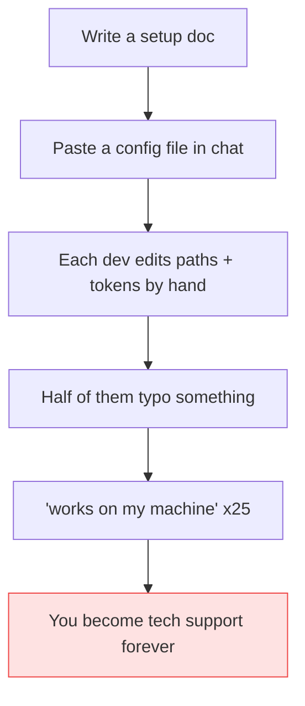
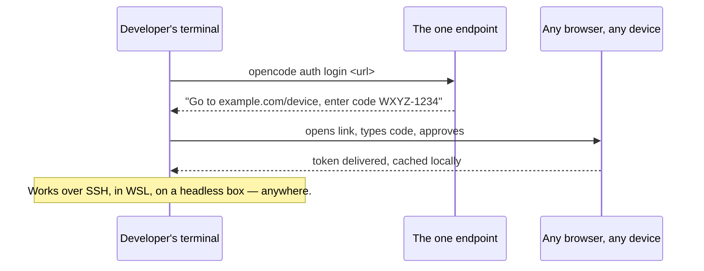
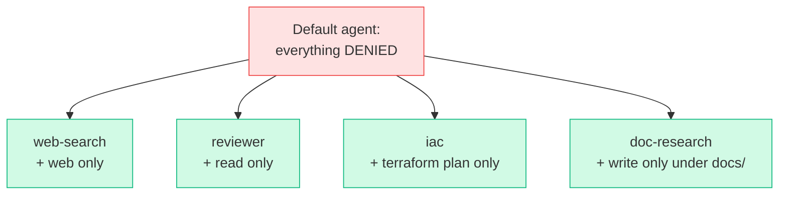
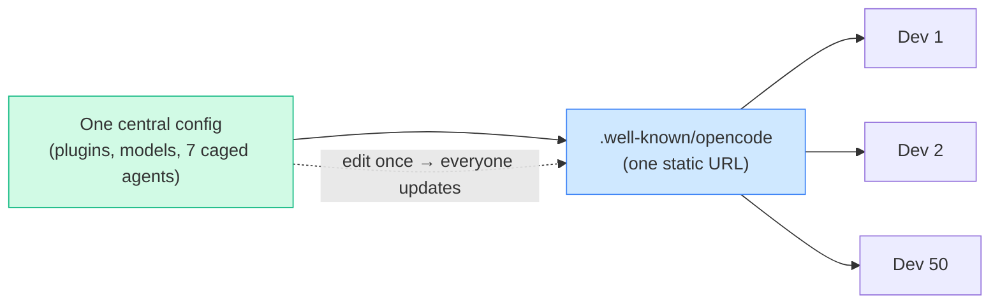

# OpenCode Well-Known: Across the Plugin-Verse

> **What everyone "knows":** *to set up an AI coding assistant for a whole team, you write
> a setup guide, paste a config file in Slack, and spend the next two weeks answering "it
> doesn't work on my machine."*
>
> **What actually happens:** one URL configures everyone. A single static endpoint hands
> every developer their login, their plugins, their models, and a squad of role-specialised
> AI agents — auto-installed on first launch, versioned centrally, swappable without anyone
> noticing.

*Part of a little series for people watching AI eat everything and wondering how you give a
team superpowers without giving them a 40-page onboarding doc. With apologies to Miles
Morales for the title.*

---

## The belief: rolling out AI tooling is a logistics nightmare

Picture giving 50 developers the same AI coding setup the old way:



Everyone ends up on a slightly different version. Updating means doing it all again. This is
why most teams just… don't, and let everyone freelance their own AI setup. Which is its own
quiet disaster.

There's a much better way, and it fits in one URL.

---

## The reality: one endpoint, the whole org

The entire team config lives at a single address — a `.well-known/opencode` endpoint. A
developer runs exactly one command:

```
opencode auth login https://ai.example/opencode
```

…and from that one line, four things happen automatically.

### 1. Login that works literally everywhere

The endpoint doesn't do the usual "pop open a browser tab on this machine" dance — which
breaks the second you're on a server over SSH, in a container, or on a remote dev box. It
uses **device-code login**: your terminal prints a short code and a URL, you open that URL on
*any* device (your phone, your laptop, whatever has a browser), type the code, done.



> 🤓 *Nerds, this part's for you:* that's RFC 8628 device authorization flow against
> Keycloak, with an `offline_access` scope so the token quietly refreshes. The `auth.command`
> field in the JSON is a harmless no-op stub (`echo plugin-managed`) that only exists to
> satisfy schema validation — the real Authorization header is injected per-request by a
> plugin hook. The stub is theatre; the plugin does the work.

### 2. Plugins that install themselves

The config lists a handful of plugins by name. On first launch, OpenCode reads that list and
**installs them itself** — no `npm install`, no "first, add this plugin." They land cached on
the machine and just work. Want to add a plugin for the whole team next month? Add one line to
the central config. Everyone gets it on their next launch.

### 3. Models you can swap without telling anyone

The config points at models by **branded aliases** — names like `adorsys-researcher`,
`adorsys-coder`, `adorsys-reviewer` — not at specific vendor models. Behind the alias, the
maintainer can swap which actual model powers it (cheaper this month, smarter next month)
**without editing this config or notifying a single user.** The team asks for "the reviewer";
what answers can change underneath. That indirection is the whole trick to staying cost-lean
without a migration every time the model market moves (which is weekly).

### 4. A squad of role-specialised agents — each in its own cage

This is the part people don't expect. Instead of one all-powerful AI assistant that can do
anything (and therefore can do anything *wrong*), the config ships **seven specialists**, and
each one is locked to only the tools its job needs:

| Agent | Its job | What it's allowed to touch |
|---|---|---|
| **web-search** | find things online | web search only |
| **doc-research** | look up library docs | docs lookup, can write *only* under `docs/` |
| **iac** | infrastructure | run `terraform plan` — **never `apply`** |
| **reviewer** | review code | read code only — **no editing, no shell** |
| **test** | run tests | test runners, scoped edits |
| **skill** | run packaged skills | the skills directory only |
| **frontend** | UI work | design references + browser tools |

The default assistant starts with **nothing** — every tool is denied by baseline. Each role is
a *whitelist* that re-enables only its own tools:



Why bother? Because "an AI that can run any command" is one confident hallucination away from
`terraform apply` on production. Giving each role a cage means the *reviewer* physically cannot
edit your files, and the *infrastructure* agent physically cannot destroy anything — no matter
how persuasively it argues with itself. Least privilege, but for robots.

---

## The same rollout, drawn honestly



No setup doc. No per-machine fiddling. No "works on my machine." Change the config, the whole
team moves together on the next launch.

## Yes, but — one URL that configures everyone is one URL that *breaks* everyone

Flip the happy diagram around and it gets uncomfortable fast. "One endpoint configures the whole
org" also means **one bad push is an org-wide outage.** Those fifty slightly-different setups I
mocked at the top had a hidden virtue: blast radius. When my hand-rolled config broke, it broke
*me* — not all fifty of us at once. Centralization quietly trades many small independent failures
for one rare collective one.

And the auto-install magic has a darker reading. "Plugins arrive on first launch" also means **a
*compromised* plugin arrives on first launch** — on every developer's machine and every CI
runner, as code execution, the moment they start the tool. You've outsourced trust to a registry
and wired it to run everywhere, automatically. That's a supply-chain attack surface with a bow on
it.

> 🤓 *Nerds, this part's for you:* the convenience and the risk are *literally the same property*
> — one lever moves everyone — seen from two sides. The mitigations are unglamorous and
> non-negotiable: **pin plugin versions** (don't float on `@latest` for anything you don't
> control), stage and roll the central config like production instead of editing it live, vet the
> sources, and keep a break-glass "ignore the central config" path for the day the central thing
> *is* the broken thing.

So the synthesis: don't centralize *casually.* A central config you push on a whim is a loaded
gun pointed at the whole org; the same config under real release discipline — versioned, staged,
pinned, reversible — is the superpower the article promised. The lesson was never "centralize."
It's "centralize, and then *earn* that power by engineering the center to deserve it."

## The takeaways

1. **Centralise the config, not the support burden.** One endpoint means one source of truth
   and one place to update — not 50 slightly-wrong copies.
2. **Device-code login is the unsung hero.** It's the difference between "works on my laptop"
   and "works on every machine I'll ever touch, including the headless ones."
3. **Hide your models behind aliases.** Swap the engine without a migration or an
   announcement. In a market that changes weekly, this is sanity.
4. **Don't ship one almighty agent — ship specialists in cages.** Least privilege keeps the
   reviewer from editing and the infra bot from deleting. The constraint *is* the feature.
5. **The convenience and the risk are the same lever.** One URL that configures everyone can
   break — or compromise — everyone. Pin versions, stage rollouts, keep a break-glass exit;
   centralize only as carefully as you'd run production.

The "plugin-verse" is just this: one address, many specialised tools, every developer dropped
into the same well-equipped, well-fenced universe — without a single setup call.

---

*Part of the series · Back to the [index](README.md). Up next in this corner of the multiverse:
who's actually reviewing all the code these agents help write?*
