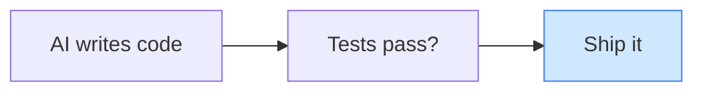
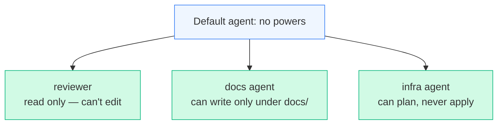
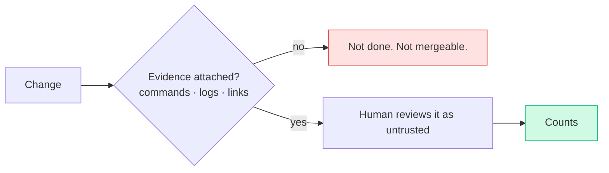
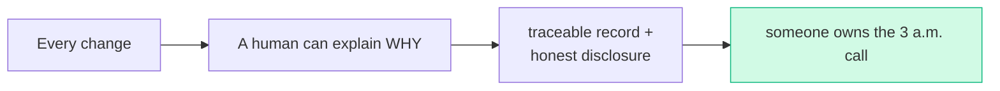
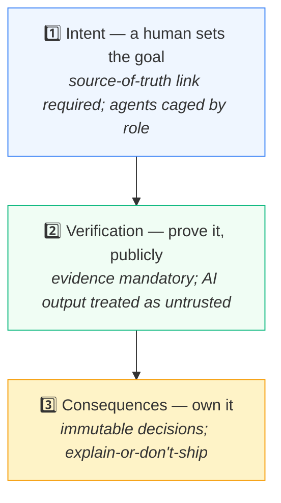

# I, Developer: Three Laws for Working With AI

> **What everyone "knows":** *the AI writes the code, you run the tests, you ship. The human
> is basically a "merge" button with opinions.*
>
> **What actually happens:** the AI is allowed to accelerate the work and nothing more. A
> human still owns the *intent*, the *verification*, and the *consequences* — and a real
> team encodes those three as rules a pull request physically cannot pass without honouring.

*Part of a little series for people watching AI eat everything and wondering what's still
their job. Short answer: the important parts. Title borrowed from Asimov, because three laws
felt right.*

---

## The belief: AI writes, human ships

It's seductive because it's *mostly* true on a good day. The model really can produce working
code fast. The problem is the two silent assumptions: that "tests passed" means "it's correct,"
and that nobody needs to be able to *explain* what shipped. Both fail exactly when it matters —
on the weird change, the security-relevant one, the one someone asks about in six months.

So mature teams replace the two-box pipeline with a single principle: **AI may accelerate the
work, but humans own intent, verification, and consequences.** Three laws. Here they are, and
how each one is actually enforced — not as a poster on the wall, but as something the merge
gate checks.

---

## The First Law — a human owns the *intent*

> *An AI may not set the goal; a human decides what we're building and why.*

The failure this prevents: an AI, asked to "improve" something, cheerfully invents what
"improved" means and builds *that.* Confident, plausible, and not what anyone wanted.

How it's enforced: **every piece of work must point at a source of truth** — a ticket, a spec,
a design doc, a decision record. No link, no merge. It sounds bureaucratic; it's actually the
thing that keeps the AI building *your* plan instead of one it daydreamed.

And it goes deeper than process. The AI agents themselves are **caged by role** so they can't
quietly redefine the job:

The infrastructure agent can *propose* a change but never *apply* it. The reviewer can read but
never edit. Intent is protected not by trust but by what each tool is physically allowed to
touch.

---

## The Second Law — verification is mandatory, and public

> *An AI's output is not truth; it is reviewed as untrusted and proven before it counts.*

The failure this prevents: "the tests are green, ship it" — when green tests prove the code
*runs*, not that it does the right thing, and when nobody actually read what the model wrote.

How it's enforced: **every change carries its evidence.** Not a vibe — an actual artifact. The
command you ran and its output. A link to the passing pipeline. A description of what you
tested by hand. A deterministic check confirms the evidence is *there* before the merge button
lights up.

> 🤓 *Nerds, this part's for you:* "tests" here aren't unit tests — the system is
> infrastructure-as-config, so verification means *does it render, is it free of leaked
> secrets, are the versions pinned, does the security scan pass.* The shape differs per project;
> the rule doesn't. "Show your work" is the constant. And the governance check that enforces it
> is itself deterministic — it can't be sweet-talked, because it only asks "is the evidence
> present," not "is it good." A human judges *good.*

The subtle move: the AI's *reviewer* is advisory (it can be wrong), but the *evidence
requirement* is deterministic (it's either attached or it isn't). The robot suggests; the
checkable rule enforces. (That split gets its [own article](05-who-reviews-the-reviewers.md).)

---

## The Third Law — a human owns the *consequences*

> *Never submit work you cannot explain.*

This is the one that matters at 3 a.m. six months later, when something breaks and someone asks
"why is it built this way?" If the honest answer is "the AI suggested it and it looked fine,"
you don't have an engineer, you have a roulette wheel with a keyboard.

How it's enforced, in three quiet habits:

- **Decisions are written down and frozen.** Architectural choices become records that, once
  accepted, are *immutable* — to change one you write a new record that supersedes it, leaving
  the old reasoning intact. So every choice traces to a human who made it, on a date, for a
  stated reason. No silent rewrites of history.
- **Commits explain *why*, not what.** The diff already shows what changed; the message exists
  to capture the reason a human can stand behind.
- **AI assistance is disclosed, not hidden.** AI-assisted commits carry a trailer naming the
  model that helped — a signature that says "a machine contributed here, and a human reviewed it
  and is taking responsibility." Honesty about the tool, ownership of the result.

---

## The three laws on one card

## Yes, but — isn't this just process theater that slows you down?

Here's the objection that actually stings. While you're collecting source-of-truth links and
verification evidence for every pull request, the AI-native team across town is letting the
model rip and shipping three times as fast. In a land grab, speed wins and ceremony is friction;
a startup that governs every commit like it's launching a rocket will lose the market long
before its discipline pays off. That critique isn't dumb. It's often right.

And there's a sharper version. The Third Law — *never submit work you can't explain* — quietly
assumes you always *can.* But as AI generates systems no single human fully traces, "explain it"
drifts from a check into an aspiration, and a law everyone secretly violates is worse than no
law: it breeds exactly the theater the critic is accusing you of.

> 🤓 *Nerds, this part's for you:* the trap in **both** critiques is the word *uniform.* Theater
> is what you get applying rocket-launch ceremony to a typo fix. Negligence is what you get
> applying typo-fix ceremony to a database migration. Same process, wrong altitude — and altitude
> is the whole game.

So the synthesis: the Three Laws aren't speed brakes, they're **blast-radius controls,** and you
spend them in proportion to consequence, not evenly across everything. Trivial and reversible?
Let the AI rip, sign it, move on — minimal ceremony. Irreversible, security-shaped, money-shaped,
data-shaped? Full laws, every time. And the explainability law isn't "explain every token" — it's
"a human can explain the **decision and what happens if it's wrong**," which stays possible even
when the implementation is AI-dense. The team that wins isn't the cowboy *or* the bureaucrat.
It's the one that spends its entire governance budget only where a mistake is expensive, and lets
everything else fly.

## The takeaways

1. **AI accelerates; it doesn't authorise.** Speed is the gift. Intent, verification, and
   consequences stay human — and you can wire that into the merge gate instead of hoping.
2. **Make the AI build your plan, not its own.** A required source of truth, plus role-caged
   agents, keeps it from inventing the goal.
3. **"Green" is not "correct."** Demand evidence, treat output as untrusted, and let a
   deterministic rule — not a chatbot — enforce that the proof exists.
4. **If you can't explain it, you can't ship it.** Frozen decisions, honest disclosure, and
   commit messages that say *why* are how a human stays accountable for what a machine helped
   write.
5. **Govern by blast radius, not by reflex.** Uniform process is how you get theater on the
   trivial and negligence on the dangerous. Spend ceremony where a mistake is expensive; let the
   reversible stuff fly.

The fear of the moment is "AI is taking the work." These three laws are the calm answer: it's
taking the *typing.* The judgment — what to build, whether it's right, and who answers for it —
was always the actual job, and it's still yours. The laws just make sure nobody forgets that on
a fast day.

---

*Back to the [index](README.md). This closes the loop on the series so far — from picking a GPU
to owning the consequences of what runs on it.*
