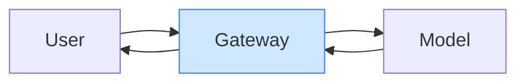
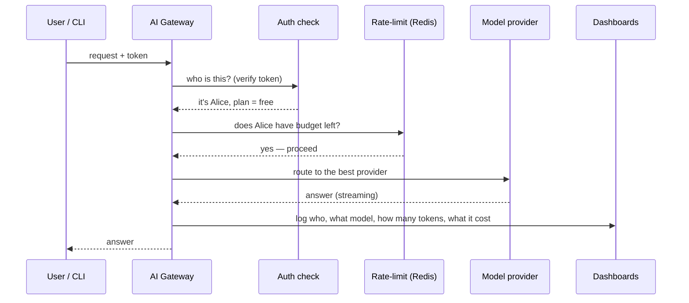
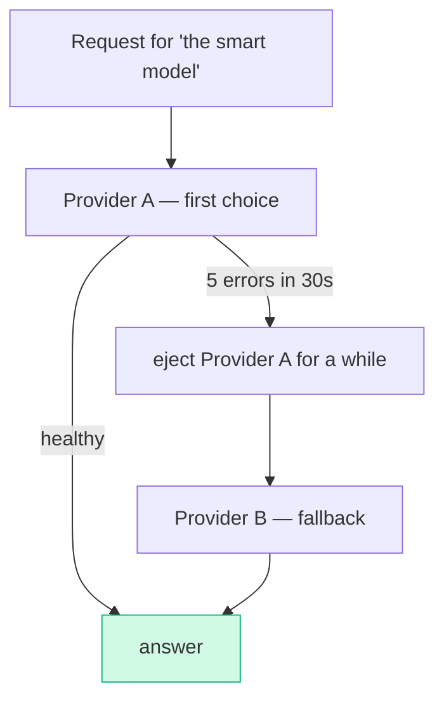
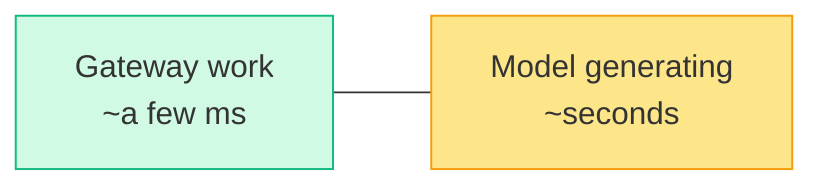
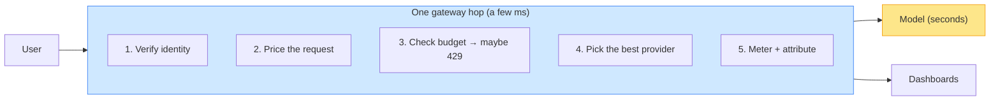

# Envoy AI-Gateway: Everything Everywhere All at Once

> **What everyone "knows":** *a gateway is a glorified signpost. It forwards your request
> to a backend and gets out of the way. Maybe it adds a little latency.*
>
> **What actually happens:** on a single hop, the AI gateway checks who you are, works out
> what your request will cost in real money, decides whether your budget allows it, picks
> which of several providers answers, and ships a metered record of the whole thing to your
> dashboards. One door, six jobs — and somehow it's the *cheap* part of the system.

*Part of a little series for people watching AI eat everything and wondering what all this
"AI gateway" talk actually buys them. Title borrowed, with respect, from a film about a
woman doing far too many things at once. Relatable.*

---

## The belief: a gateway just forwards traffic

Request in, request out. A signpost. If you've set up an nginx reverse proxy, you think you
know this story.

You don't, because an *AI* gateway is sitting on top of three things a normal proxy never
deals with: **identities that map to people, requests that cost real money, and a dozen
interchangeable model providers behind one address.** That changes the job completely.

---

## The reality: six jobs, one hop

Here's what actually happens to a single request, in the few milliseconds before it ever
reaches a model:

Let's take the surprising ones.

### Job 1 — it knows who you are, as a *person*

The gateway verifies your login token and turns it into an identity: a user ID, which app
you came from, and which billing plan you're on. Everything downstream — limits, cost,
dashboards — keys off that. (This is its own rabbit hole; it gets the
[next article](08-the-multiverse-of-secure-ai.md) to itself.)

### Job 2 — it does your accounting in real time

This is the one people miss. As the model streams its answer, the gateway reads the token
counts out of the response, multiplies by that model's price, and stamps each request with a
cost in **micro-dollars** — millionths of a dollar. So "Alice spent $3.40 on the smart model
this month" isn't a nightly batch job; it's computed live, request by request, and it's the
number your budget limits actually check against.

> 🤓 *Nerds, this part's for you:* the price is a CEL expression attached to each model route
> — weighted input / cached-input / output rates — evaluated against the usage metadata in the
> response. The result rides the access log out to the collector as an integer µ\$ field. No
> separate metering service; the proxy is the meter.

### Job 3 — it enforces your budget before the model runs

Two different limits, enforced from a shared Redis:

- **Burst limit** — per minute. Illustratively: a free user might get 200 requests/min and
  1,000,000 tokens/min. Stops runaway loops.
- **Budget limit** — per month, in dollars. Illustratively $50 (free) / $200 (pro). Stops your
  wallet.

Trip either one and you get a polite **429 "slow down."** Crucially, *the limit lives in front
of the model* — you're stopped before you spend money, not billed after.

### Job 4 — "one model" is actually many providers

You ask for a model by name. Behind that name, the gateway may know **two or three providers
that serve it**, ranked by preference:

If the first provider starts throwing errors, the gateway *ejects* it for a cooldown and
quietly routes to the backup — and the *same* model name can even include your own
self-hosted GPU as one of the options. You get one stable address; the gateway handles the
messy reality of "which vendor is up right now," with unified accounting across all of them.

### Job 5 + 6 — it logs everything, attributed and queryable

Every request leaves a trail: who, which app, which model, how many tokens, how long, what it
cost. That stream feeds the per-user dashboards (the subject of a later article). The gateway
is also where your *observability* of AI usage is born — it's the only place that sees every
request with both the identity and the cost attached.

---

## The plot twist: all of this is the *cheap* part

Here's the counterintuitive bit. You'd assume "verify + meter + rate-limit + route + log on
every request" is heavy. It isn't. The gateway's own work takes **low single-digit
milliseconds**; the token verification is cached so it never even leaves the process.

Where does a request actually spend its time? **Seconds, inside the model provider's GPU**,
generating text. The proxy is a hummingbird strapped to an elephant.

That's why a handful of gateway pods (this one autoscales between **3 and 5**) can ride herd
on thousands of simultaneous streams. You're not paying for the doorman; you're paying for the
kitchen. The doorman is doing six jobs and barely breaking a sweat.

> 🤓 *Nerds, this part's for you:* the tuning that makes it work is HTTP/2 stream-heavy, not
> CPU-heavy — high `maxConcurrentStreams`, large per-connection buffers (bumped way up to carry
> 1M-token contexts), hour-long idle timeouts for slow generations, and graceful 60s drains on
> rollout so in-flight streams aren't guillotined. The bottleneck is deliberately the backend,
> never the proxy.

---

## The same picture, drawn honestly

## Yes, but — one hop doing six jobs is one chokepoint doing six jobs

Everything this article celebrates — all traffic flowing through one smart gateway — is also the
thing that should make you nervous. One hop that does six jobs is **one place where six things
can break at once.** Gateway down? Every model is down, including the three providers that were
perfectly healthy. One fat-fingered rate-limit rule and you've throttled *everyone*
simultaneously. The cheery "it's cheap, a few pods handle the whole org" line cuts both ways — a
few pods are also a small, *shared* blast radius. And there's a quieter discomfort: one hop that
sees every user's every prompt, identity, and cost is a concentration of *surveillance,* not just
of routing. That's power, and power in one place is a target.

The "just call the provider directly, skip the middleman" crowd has a real point: the simplest
architecture that works has the fewest things that can fail, and direct-to-provider has no
chokepoint to take down.

> 🤓 *Nerds, this part's for you:* you don't get the benefits without the concentration — so you
> engineer the center to be *worthy* of it. That's *why* it autoscales across several replicas
> instead of running as one cheap box; why the failure modes must be deliberate (**auth fails
> closed**, but a **metering hiccup must never drop live traffic**); and why "one place sees
> everything" is a governance responsibility with guardrails, not a free feature you forget about.

So the honest synthesis: a gateway converts *many distributed, invisible problems* — per-app
auth, per-app cost, per-app failover, scattered logs — into **one concentrated, visible
problem.** That's a genuinely good trade, because concentrated problems are tractable and
distributed ones are whack-a-mole. But you concentrated the *risk* in the very same move, and you
have to resource the center accordingly. A gateway you run like a single cheap proxy isn't a
control plane — it's a single point of catastrophic failure wearing a control plane's costume.

## The takeaways

1. **An AI gateway is a control plane, not a signpost.** Identity, cost, budgets, failover,
   and metering all happen on one hop — things a plain proxy never touches.
2. **It meters in real time.** Per-request cost in micro-dollars *is* the budget number. No
   nightly reconciliation, no surprises at month-end.
3. **"A model" is a promise, not a vendor.** Federation with priorities and auto-ejection
   means one stable name in front of several flaky providers (your own GPU included).
4. **The proxy is the cheap part.** Sub-millisecond work; the seconds live in the model's GPU.
   That inversion is *why* a few gateway pods serve a whole org.
5. **Centralizing the jobs centralizes the failures.** One hop with six responsibilities is one
   chokepoint and one surveillance point. Worth it — but only if you make the center HA, choose
   its fail-open vs fail-closed modes on purpose, and treat "it sees everything" as a duty.

If a gateway felt like overkill for "just calling an API" — this is why it isn't. It's doing
everything, everywhere, all at once, and the bill barely notices.

---

*Next: [AI Gateway + Authorino: The Multiverse of Secure AI →](08-the-multiverse-of-secure-ai.md)
— because "who are you?" turns out to have several universes' worth of answers.*
