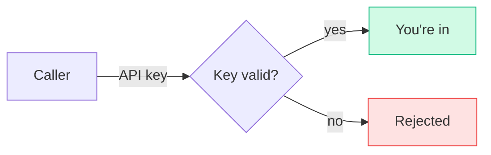
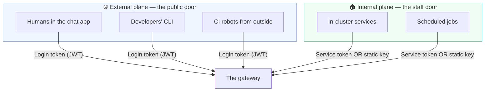
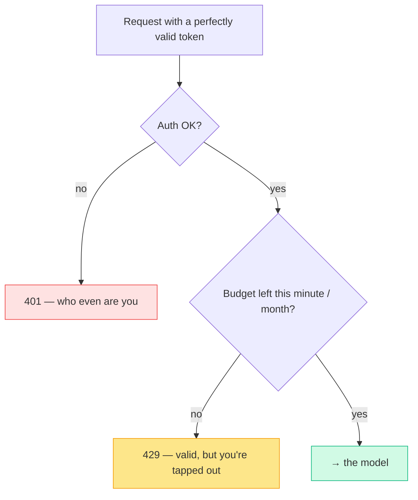
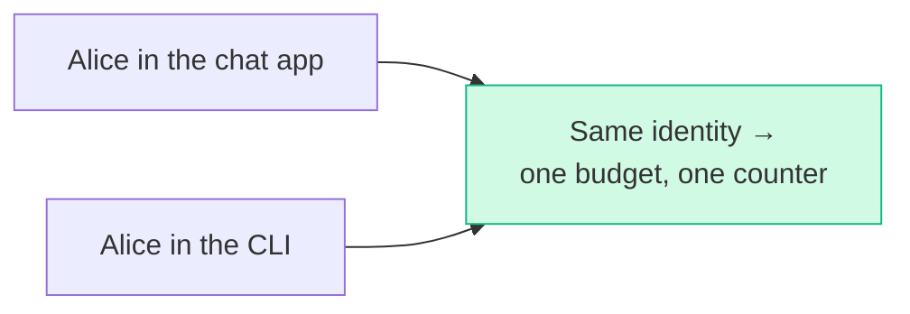
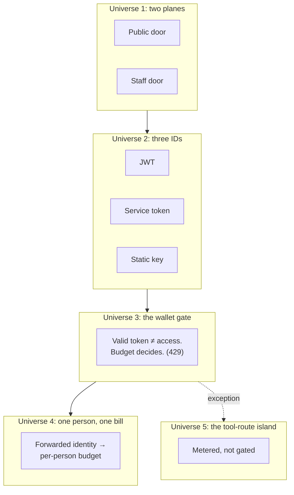

# AI Gateway + Authorino: The Multiverse of Secure AI

> **What everyone "knows":** *securing an AI endpoint is one thing — check an API key. Key's
> good, you're in.*
>
> **What actually happens:** "who are you?" has several universes' worth of answers. Humans
> and robots enter through different doors, carry different kinds of ID, and the thing that
> actually stops you isn't the bouncer at all — it's your own wallet. Welcome to the
> multiverse.

*Part of a little series for people watching AI eat everything and quietly wondering who's
allowed to use the expensive toys, and who's paying. Title tipping its hat to a certain
Sorcerer Supreme.*

---

## The belief: auth is one door and one key

Clean. One door, one key, one verdict. It's how most internal services are "secured," and
it's fine right up until the thing behind the door costs real money *per request* and is used
by both people and machines. Then this model quietly falls apart, because it answers the wrong
question. The question isn't "is the key valid?" It's "*who is this, what may they spend, and
who pays?*"

That needs a multiverse.

---

## Universe 1 — two planes: the public door and the staff door

The same gateway is reachable two completely different ways, and they trust differently:

- **External plane** — the public, internet-facing address with real TLS. Everyone here proves
  themselves with a proper login token (a Keycloak JWT). Humans, developer CLIs, outside CI.
- **Internal plane** — an address that only exists *inside* the cluster, never exposed. Things
  here are first-party services, so they get a lighter-weight proof.

Same routes, same models behind them — but which door you came through decides which rulebook
applies. One gateway, two universes.

---

## Universe 2 — three kinds of ID

"Identity" isn't one thing either. Depending on who you are, you carry one of three:

| Who | Carries | Why |
|---|---|---|
| **A person** | a login token (JWT) | maps to a real human, a plan, a budget |
| **A robot from outside** (CI) | a service-account token | a machine principal, higher burst, no human wallet |
| **An in-cluster service** | a service token *or* a static key | first-party, trusted, lives behind the staff door |

A small auth service (Authorino) sits just inside the gateway and validates whichever one
shows up. On success it doesn't just say "ok" — it *stamps the request* with a set of headers:
who you are, which app you came from, your plan. Everything downstream reads those.

> 🤓 *Nerds, this part's for you:* it's an external-authorization (ext_authz) gRPC call from
> Envoy to Authorino. The signing keys are cached for an hour, so verification almost never
> leaves the pod. On success it injects a contract of `x-oidc-*` headers (user id, client, email,
> roles, scope, …) plus the three rate-limit *descriptors* — account, org, plan — that the next
> universe runs on. The internal plane validates a Kubernetes token via the API server's
> TokenReview, or a static key by matching a labelled secret. Different proof, identical
> downstream headers.

---

## Universe 3 — the bouncer isn't what stops you. Your wallet is.

Here's the twist that breaks the "valid key = you're in" model entirely.

A valid token gets you *past auth*. It does **not** get you to the model. Between the two sits
a second gate: **your own budget.** The gateway keeps per-user counters in Redis, and checks
them on every request:

So the most common "access denied" on an AI platform isn't a security failure at all — it's
**a perfectly authenticated user who hit their own limit.** A 429, not a 401. Your token is
fine; your minute (or your month) is not.

That reframes the whole thing: on an AI platform, *authorization is mostly economics.* The
question "may you do this?" is really "can you afford it right now?"

---

## Universe 4 — one person, many faces, one bill

People don't use one app. Alice chats in the web UI in the morning and drives the CLI from her
terminal in the afternoon. Naively those look like two different callers — and you'd bill them
separately, or worse, let her dodge limits by switching apps.

The multiverse collapses them back into one person:

The trick: when an in-cluster service (like the chat app) calls the gateway *on Alice's
behalf*, it authenticates as itself **but forwards Alice's user ID.** The gateway prefers the
forwarded human over the service. So Alice's chat usage and Alice's CLI usage land in the
*same* bucket. One person, one wallet, no matter how many faces.

And the budget is **per-person**, not per-team — a deliberate change from an earlier shared-org
model. Why? Because a shared pot means one enthusiastic colleague burns the whole team's
allowance by Tuesday. Per-person budgets mean your limit is yours; nobody can spend it for you.

---

## Universe 5 — the corner of the multiverse with its own laws

There's always one universe that doesn't play by the rules. Here it's the **tool-server
routes** (the MCP endpoints — the connectors that let an AI use external tools like search or
docs).

These routes **displace the main auth policy entirely** and run their own: still real token
verification, but the rate-limit-and-budget machinery is switched off. The tool servers
upstream enforce their own quotas, so the gateway *meters* this traffic (it still shows up in
your dashboards, attributed per user) but doesn't *gate* it with budgets.

It's the one place where "authenticated" really does mean "in" — a small island running the
old simple rules, on purpose, because the economics live somewhere else.

---

## The multiverse, on one map

## Yes, but — every universe you added is also a door

The multiverse is elegant, and elegance in auth should make you suspicious. Each plane, credential
type, and CEL default is one more thing to misconfigure into a hole — **complexity *is* attack
surface.** "Authorization is mostly economics" is a great line, but a budget cap is a *cost*
control, not a *security* boundary; a 429 never stopped an attacker, only a spender. And the
per-person magic leans on a first-party service *vouching* for a user via a forwarded header —
trustworthy exactly as long as that service is.

**So the dual-plane design isn't secure *because* it's clever — only if the clever parts fail
closed and the trust assumptions are real.** Treat the budget layer as billing-safety, the JWT
layer as the actual lock, and forwarded identity as a trust you must keep strictly first-party.
The multiverse buys you per-user economics; don't let it talk you into believing economics is the
same thing as a lock.

## The takeaways

1. **"Valid key = access" is the wrong model for paid AI.** The real questions are *who*,
   *what may they spend*, and *who pays* — and a key answers none of them.
2. **There isn't one door.** Humans and services enter different planes with different proofs,
   and that choice decides the rulebook, not the route.
3. **The most common rejection is a 429, not a 401.** Authorization on an AI platform is mostly
   economics: not "may you?" but "can you afford it right now?"
4. **Tie every face back to one person.** Forwarded identity + per-person budgets stop both
   double-counting and the one-colleague-drains-the-team problem.

Securing AI isn't a bouncer with a guest list. It's a multiverse where identity, plane, and
budget all have to agree before a single token is generated — and the scariest villain turns
out to be a teammate with an expensive prompt and a shared wallet. Per-person budgets are the
spell that fixes that one.

---

*Previous: [← Everything Everywhere All at Once](07-everything-everywhere-all-at-once.md) ·
Back to the [index](README.md).*
