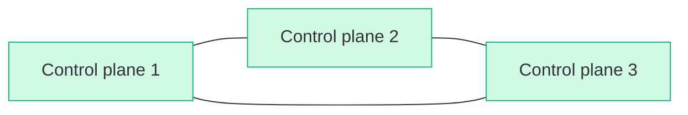
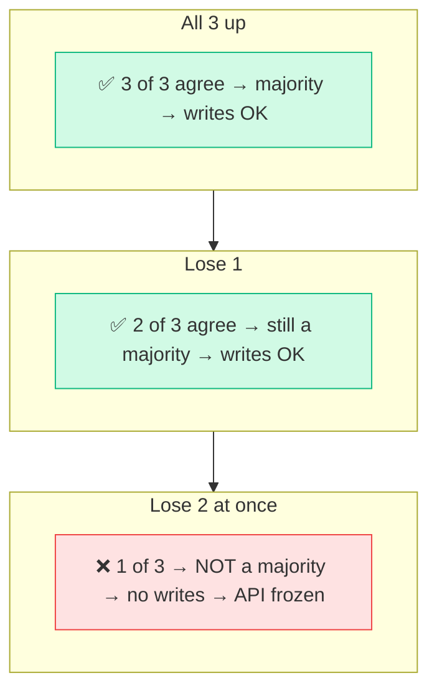
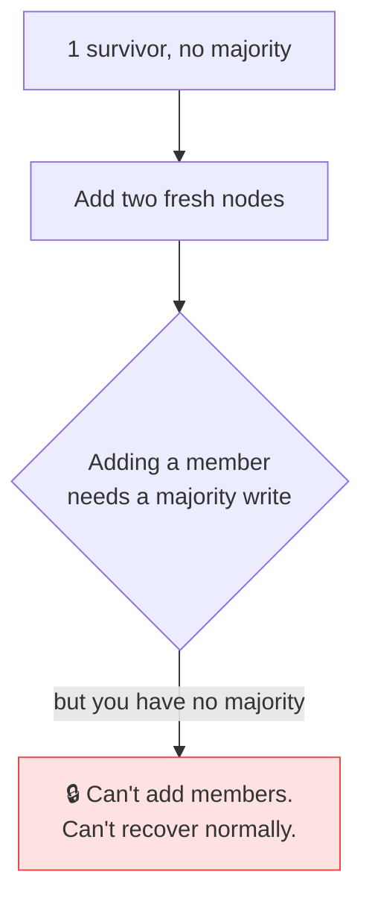
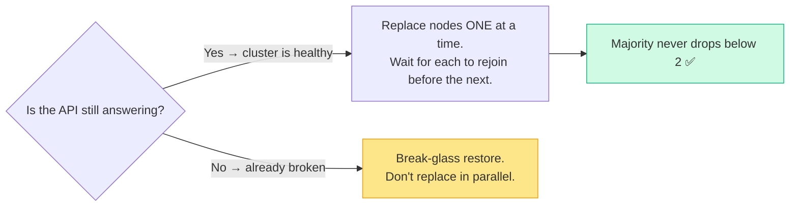

# The Three-Node Problem

> **What everyone "knows":** *I run three control-plane nodes, so my cluster is highly
> available. I can replace them like any other server — they're cattle, not pets.*
>
> **What actually happens:** three is the *minimum* for high availability, not a comfort
> margin. Underneath sits a consensus algorithm with one unforgiving rule, and the moment you
> treat two of those three nodes as disposable at the same time, the whole cluster freezes —
> and won't even let you fix it.

*Part of a little series for people watching AI eat everything and discovering that the
boring infrastructure underneath has opinions. Title is a pun on Liu Cixin's *Three-Body
Problem* — three bodies with no stable orbit turns out to be the right metaphor for three nodes.*

---

## The belief: three nodes, sleep easy

You set up a Kubernetes cluster the responsible way: not one control-plane node, but **three.**
Everyone says three is HA. So in your head the picture is comforting and symmetrical:

Three identical nodes, fully redundant, lose one and shrug. Cattle, not pets. So when it's time
to rebuild them — an upgrade, a migration, a config change — you do what you'd do to any
disposable server: tear them down and let automation put them back.

That instinct, applied to *two of the three at once*, is how you take down the entire cluster.
Here's why the symmetry is a lie.

---

## The reality: there's a voting booth in there

The brain of a Kubernetes control plane is a small database called **etcd**, and etcd doesn't
do "redundant copies." It does **consensus** — the nodes hold a continuous election, and
nothing is written unless a **majority** agrees. (The algorithm is called Raft; the only thing
you need from it is the word *majority*.)

Majority of three is two. Which gives you exactly the resilience everyone promised — and a
cliff nobody mentioned:

Lose **one** node and the other two still form a majority — the cluster runs, unbothered. This
is the HA you were promised, and it's real.

Lose **two at the same time**, and the single survivor is one vote out of an electorate of
three. It *cannot* form a majority. So it refuses every write. The API goes read-only and then
unresponsive. Your cluster is, functionally, down — held hostage by its own safety rule.

---

## The trap door: it won't let you fix it the obvious way

Here's the part that turns a bad afternoon into a *very* bad one. Your instinct, staring at one
lonely survivor, is "fine, I'll just add two fresh nodes back." But **adding a member to the
consensus group is itself a write** — and writes need a majority, which is the exact thing you
no longer have.

The cluster is wedged: too broken to serve, too broken to repair through the front door. Getting
out means a hands-on, break-glass procedure — manually telling the survivor to *forget* the two
dead voters and form a new single-member majority, then carefully growing back. Not a thing you
want to be googling at 2 a.m.

> 🤓 *Nerds, this part's for you:* etcd never auto-evicts dead members — a missing peer is
> "maybe it'll come back," not "it's gone." So the survivor keeps counting the two corpses in
> the denominator. The escape hatch is a forced `--cluster-reset` that rewrites the member list
> to just itself; then you re-add nodes one at a time, each rejoining a *healthy* majority. The
> real-world version of this outage came from re-running an automation step with a "restore"
> flag still set, which force-replaced two control planes *in parallel.* One survivor, two
> ghosts, frozen API.

---

## So why three? And why not five?

If two-at-once is fatal, you might ask why not just run one node (nothing to disagree with) or
nine (surely safer). The consensus math answers both:

| Nodes | Majority needed | Can lose | Verdict |
|---|---|---|---|
| 1 | 1 | 0 | not HA — one failure is total loss |
| **3** | **2** | **1** | **the sweet spot** |
| 4 | 3 | 1 | tolerates the *same* as 3, costs more, bigger split-brain surface |
| 5 | 3 | 2 | more resilient — but you're paying for 5 to survive a rare double failure |

Two things fall out of this table. **One** is no good — there's no majority to lose, so a single
failure is the whole cluster. **Even numbers are a trap** — four nodes still only tolerate one
failure (majority of four is three), so you paid for a fourth node and bought *nothing*, while
adding more ways to split the vote. Odd numbers only. Three is the cheapest number that's
genuinely HA; five is for when a double failure is a real risk and you'll pay to survive it.

> The deeper point: in a consensus system, nodes are **voters, not replicas.** "I have three, so
> I can lose two" is replica-thinking. The truth is "I have three, so I can lose *one* and still
> hold an election."

---

## How to actually treat them as cattle

You *can* rebuild control planes freely — the trick is respecting the majority while you do it:

One at a time. Each new node fully rejoins the majority before you touch the next. A healthy
cluster keeps answering its API the whole way through — which is exactly why a good automation
guard *checks the API is alive before it dares replace a control plane.* If the front door
answers, the house is fine; leave the load-bearing walls alone and only swap the workers.

## Yes, but — isn't this exactly why managed Kubernetes exists?

Of course. Use a hosted control plane and you never see etcd, never replace a control-plane node,
never learn the word "quorum." The cloud runs the consensus; you run workloads. For most teams
that's the correct, boring answer — pay someone to hold the dangerous part.

But the trap didn't vanish, it *moved*: someone still runs that etcd (it's just the provider's
3 a.m. now), you've traded the failure mode for **lock-in and a bill**, and the day you hit a
multi-region, on-prem, or data-sovereignty requirement the quorum math is waiting for you exactly
where it always was. **Managed Kubernetes doesn't repeal the three-node problem — it *rents* you
out of it. Learn the math anyway, because the rental ends precisely when the stakes get high
enough to leave.**

## The takeaways

1. **Three is the minimum for HA, not a buffer.** It survives losing **one** node, not two.
   The symmetry of "three identical nodes" hides an asymmetric rule.
2. **Consensus nodes are voters, not copies.** Lose the majority and the cluster freezes *and*
   locks you out of the normal repair path. Plan for break-glass before you need it.
3. **Replace control planes one at a time**, and let each rejoin before the next. Never two in
   parallel. Gate any automation on "is the API still up?"
4. **Odd numbers only; three unless you've justified five.** Four buys you nothing but cost and
   a wider split-brain. The math doesn't care about your intuition.
5. **Managed Kubernetes rents you out of this, it doesn't repeal it.** Someone still runs the
   etcd; you traded the cliff for lock-in. Learn the quorum math anyway — you meet it again the
   moment you go multi-region, on-prem, or sovereign.

"I have three control planes" feels like a finished sentence. It isn't — it's the setup to a
consensus problem with no stable shortcut. Respect the majority and three nodes will carry you
for years. Forget it for one parallel `replace` and you'll meet the three-body problem the hard
way: three bodies, and suddenly no stable solution at all.

---

*Part of the series · Back to the [index](README.md).*
