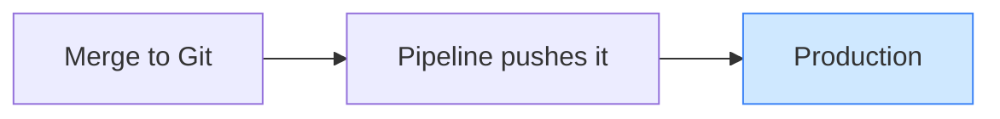
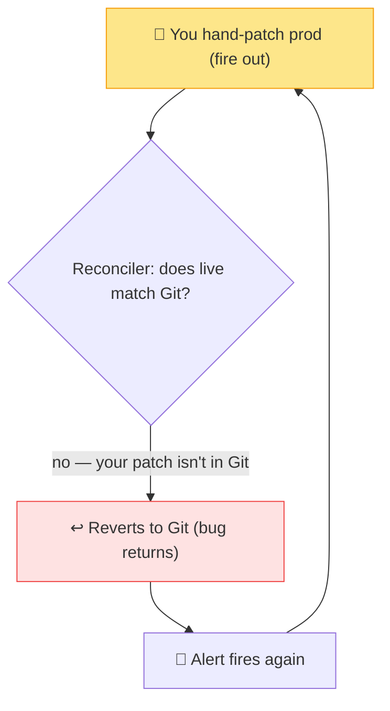
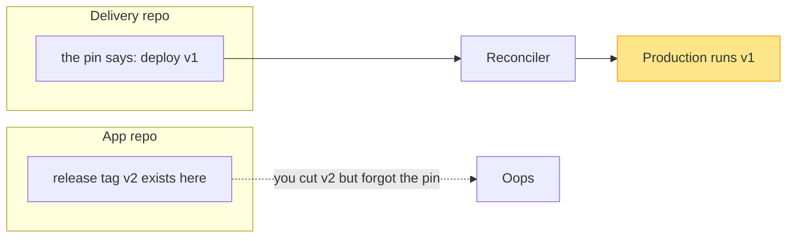
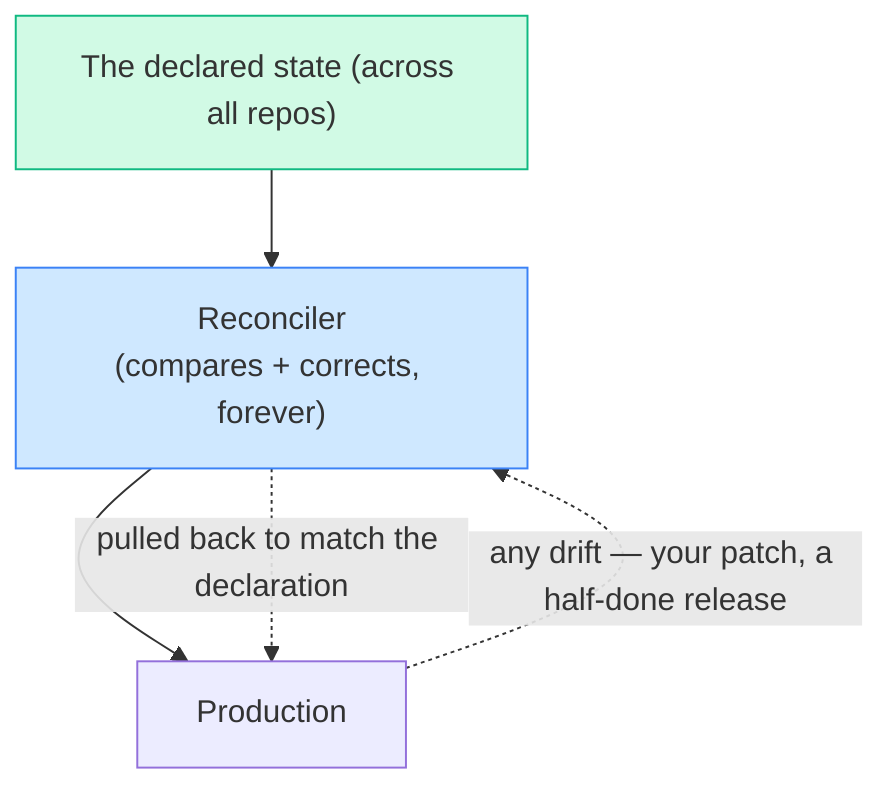

# Git-hog Day

> **What everyone "knows":** *GitOps just means "deploy from Git instead of my laptop." And
> self-healing is great — it keeps the cluster matching what I want.*
>
> **What actually happens:** the cluster now has a will of its own. Patch production by hand
> in an emergency and a tireless robot quietly *undoes* your fix a few minutes later — no
> prompt, no warning. And "what I want" turns out to be pinned across two different repos, so a
> half-finished release can roll *itself* back. Patch. Revert. Repeat.

*Part of a little series for people watching AI eat everything and finding that the deployment
system has started eating their hotfixes. Title is a pun on *Groundhog Day*, the Bill Murray
one where he wakes up at the start of the same day, over and over, until he learns. You'll see why.*

---

## The belief: Git is just a fancier deploy button

Most people meet GitOps as "kubectl apply, but from CI." You merge a change, a pipeline pushes
it, done. Same mental model as every deploy you've ever done — Git is just the launchpad.

Under that model, production is something you *push to.* You're the active party; the cluster is
a passive target that does what it's told and then waits.

Real GitOps inverts that completely, and the inversion is the whole story. The cluster isn't a
target you push to — it's an agent that **continuously compares itself to Git and fixes any
difference it finds, forever.** That sounds wonderful right up until *you* are the difference.

---

## The reality: a robot that reverts you, calmly, on a loop

Picture a genuine 2 a.m. incident. Something's on fire, the fix is one field, and you don't have
time for a full PR-review-merge cycle. So you do what every engineer has done: you patch
production directly. It works. The fire's out. You go back to bed.

A few minutes later, the reconciler wakes up, notices production no longer matches Git, and —
without asking, warning, or logging anything you'll see in time — **puts the bug back.** The
alert fires again. You patch again. It reverts again.

Patch. Revert. Repeat. You're Bill Murray, the loop is self-heal, and there is no prompt, no
approval gate, no "are you sure?" The system isn't malfunctioning — it's doing *exactly* its job.
Its job is "the cluster shall match Git," and your hotfix simply isn't in Git, so as far as the
robot is concerned your fix is the bug and the bug is the source of truth.

The way out of the loop is the lesson: **in GitOps, you don't change production. You change
Git, and let production follow.** The escape hatches are (a) make the fix a one-line commit so
the reconciler is now *for* you, or (b) explicitly pause the reconciler while you work — and
remember to un-pause it, which is its own footgun. There is no third option where you win by
out-patching the robot. The robot does not sleep.

> 🤓 *Nerds, this part's for you:* this is `selfHeal: true`, and it's usually paired with
> `prune: true` — so the reconciler not only reverts edits but *deletes* anything live that
> isn't declared in Git. The trade-off is deliberate: you give up the ability to quietly hand-fix
> prod, and in exchange you get a cluster that can never silently drift from its declared state.
> Determinism bought with flexibility. Worth it — as long as everyone knows the deal before the
> 2 a.m. incident, not during it.

---

## The reality, part two: "what I want" lives in *two* repos

Here's the second twist, and it's the one that bites teams who *do* understand self-heal.

You'd assume the version of an app that's running is decided in that app's own repo. Often it
isn't. A common setup splits it: the **app repo** holds the charts and code, but a separate
**delivery repo** holds the one line that says *which version is live* — the pin. The reconciler
watches that pin.

So you ship a release: you tag `v2` in the app repo, you push it, you watch it go out. And then
it… rolls back to `v1` on its own, and you lose an hour wondering why. The reason: you bumped the
tag in the app repo but forgot to move the **pin** in the delivery repo. Self-heal dutifully
drags production back to whatever the pin says — and the pin still says `v1`. Your "release" was
a temporary suggestion the reconciler politely overruled.

This is the same loop as the hotfix, one level up. The cluster reconciles to the *declared*
state, and the declaration you forgot to update wins. A release isn't done when the new version
is running; it's done when **every** source of truth agrees on it.

---

## The same system, drawn honestly

Production is a *shadow* of the declared state, not a place you act on directly. Everything good
and everything surprising about GitOps falls out of that one fact.

## Yes, but — "never touch prod by hand" is a luxury you don't have at 3 a.m.

The determinism is wonderful until the building's on fire. "Change Git, not the cluster" assumes
you have time for a commit–review–merge–reconcile loop — and mid-outage you don't. A reconciler
that fights your emergency patch isn't protecting you then; it's *extending the outage.*

The answer isn't to abandon self-heal — it's to make **break-glass a first-class, rehearsed
path**: a one-command "pause reconciliation on this app" you've actually practiced, with an alarm
reminding you to un-pause. **GitOps purism with no fast manual override isn't disciplined, it's
brittle. The teams that survive incidents run self-heal as the steady-state default *and* keep a
fire axe behind glass.**

## The takeaways

1. **The cluster has agency.** Self-heal continuously reverts anything that doesn't match Git —
   including your emergency hotfix, silently, on a loop. Know this *before* the incident.
2. **To change production, change Git.** Hand-patching is a fight you lose by design. Commit the
   fix (now the robot's on your side) or deliberately pause reconciliation.
3. **"What's live" can span repos.** If a separate delivery repo holds the version pin, a
   release that updates one repo and not the other will roll *itself* back. Update every source
   of truth, or it isn't shipped.
4. **Determinism is the feature, not a bug.** You trade the freedom to quietly drift for a
   cluster that always matches a reviewable, version-controlled declaration. Great deal —
   stated up front.
5. **Keep a fire axe behind glass.** Self-heal is the right steady state, but an incident needs a
   rehearsed, one-command pause. Purism with no manual override is brittle, not disciplined.

GitOps isn't a fancier deploy button; it's handing the steering wheel to a relentless,
literal-minded robot whose entire purpose is "make reality match the document." Get the document
right and it'll hold your platform together flawlessly. Try to win an argument with it by hand,
and you'll be waking up at the start of the same bad day until you stop.

---

*Part of the series · Back to the [index](README.md).*
