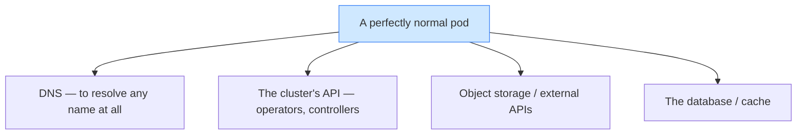
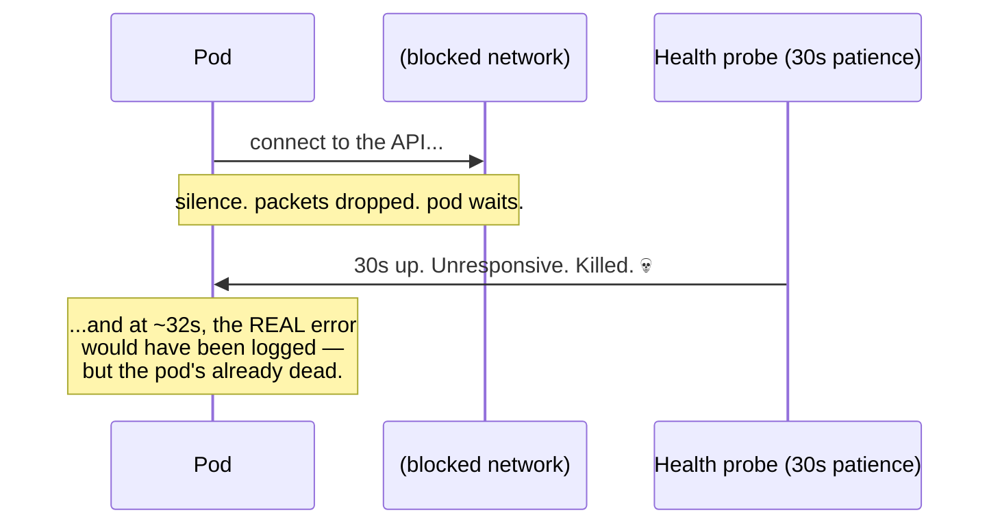
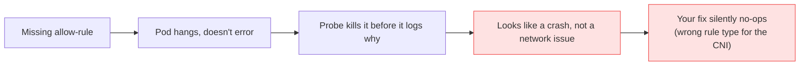

# No Country for Old Packets

> **What everyone "knows":** *locking down the network is free security. Deny all outbound
> traffic by default, allow only what you need. Pure upside — what's the downside of being
> careful?*
>
> **What actually happens:** "default-deny" is a posture, not a checkbox, and it fails
> **closed and silent.** One forgotten allow-rule doesn't throw an error — it makes a pod hang,
> then get killed, then look like a totally unrelated crash. Teams burn weeks chasing the wrong
> ghost.

*Part of a little series for people watching AI eat everything and learning that the safest-
sounding setting can quietly torch a platform. Title with a nod to the Coens — a quiet,
relentless killer and a whole lot of packets with nowhere left to go.*

---

## The belief: deny everything, sleep better

The advice is everywhere and it isn't wrong: don't let your pods talk to the whole internet.
Flip the default to **deny**, then open up only the specific destinations each service needs. A
compromised container can't phone home if it can't reach anything.

On the slide, it's pure win. Tighter blast radius, happier auditors, zero apparent cost. So you
roll it out across your namespaces and move on, feeling responsible.

The cost is real; it's just deferred and disguised. Because the day you flip that default, you
quietly signed every pod up to a rule it doesn't know about — and the failures, when they come,
won't *look* like network failures at all.

---

## The reality: now everything needs a hall pass

Here's what "deny by default" actually means in practice. A normal pod doesn't just talk to your
app — it constantly reaches out to a surprising number of places just to *function*:

Every one of those arrows now needs its own explicit allow-rule. Miss **any single one** and
that pod is broken — not "less secure," *broken.* The metrics collector can't reach the API to
discover what to scrape. The operator can't read the resources it manages. The app can't reach
its own database. And none of them get a polite "connection refused," because deny-by-default
doesn't refuse — it drops the packets into the void and lets the caller sit there.

Security controls have a **blast radius**, and default-deny egress has a big one. It's not that
the idea is wrong; it's that it converts "I forgot a config line" into "a service is mysteriously
dead," and hands you no error message to grep for.

---

## The signature crime scene: 32 seconds

This is the detail that makes the story worth telling, because it's where the misdiagnosis
lives. A pod that can't reach a destination doesn't fail fast. It **hangs** — politely waiting
on a connection that will never, ever answer — until something times out.

Now layer on a health probe that kills the pod if it isn't responsive within, say, 30 seconds.
Watch the timeline:

The pod gets executed at second 30, **two seconds before** it would have logged the actual
"network unreachable" error. So every restart shows you the same thing: a pod that starts, prints
two boring setup lines, and dies — with no error. It looks *exactly* like a crash, or an
out-of-memory kill, or a bad image. It looks like anything except what it is: a missing firewall
rule, timed perfectly to hide its own evidence. Teams chase that phantom for weeks.

> 🤓 *Nerds, this part's for you:* the kill is usually a liveness probe with a 0-second initial
> delay racing a ~32s connection timeout. The fix is an additive egress rule — but here's the
> second trap: on a modern CNI like Cilium, a plain Kubernetes `NetworkPolicy` with an `ipBlock`
> CIDR for the API server **silently does not match**, because node and API-server traffic carry
> a special *identity* (`remote-node`, `kube-apiserver`), not a plain routable IP. You have to
> use the CNI's own entity selectors (`toEntities: [kube-apiserver]`, `toFQDNs` for object
> storage). So even your *attempt* to fix it can no-op without a word. Deny-closed, all the way
> down.

---

## Why this one is so good at hiding

Stack up everything working against you and you see why this eats weeks:

Four independent things conspire: the failure is silent, the symptom is mislabeled, the evidence
is destroyed by the very probe meant to help, and the obvious fix can quietly not work. None of
them is the *idea's* fault. All of them are the cost of treating a posture like a checkbox.

---

## How to wield it without losing a week

Default-deny is still good security. The move is to treat it as a system you operate, not a flag
you flip:

1. **Allow-list the boring essentials first**, everywhere, before anything else: DNS, the
   cluster API, and your data layer. Most "mysterious crashes" are one of these three.
2. **Mind your probes.** A 0-delay liveness probe in front of a 30s network timeout will execute
   the patient before it can testify. Give startup probes room to surface the real error.
3. **Know your CNI's matching rules.** On an identity-based network, CIDR allow-rules for nodes
   and the API server don't match — use entity/FQDN selectors. Verify the rule actually took.
4. **When a pod "crashes" with no error, suspect the network before the app.** Silent + no logs +
   dies-on-a-timer is the fingerprint of a dropped connection, not a bug in your code.

## Yes, but — isn't the alternative (allow everything) just worse?

Fair: default-deny didn't invent this pain, and allow-all is genuinely less safe — so "don't lock
down egress" is the wrong lesson. The posture is correct. Which means the real culprit isn't the
policy at all.

It's the **silent, mislabeled failure mode.** A dropped connection that hung, got killed before
it could log, and looked like a crash — *that's* what burned the weeks, not the security. **Keep
deny-by-default; the fix is to make its failures *loud*: startup probes that let the real error
surface, the boring essentials allow-listed up front, and a check that your rule actually matched
(especially on an identity-based CNI). Default-deny isn't the trap. Default-deny that fails in
silence is.**

## The takeaways

- **"Free security" isn't free — it's deferred and disguised.** Default-deny egress trades an
  upfront error for a downstream mystery. Worth it, if you plan for the mystery.
- **It fails closed and silent.** No refusal, no log — just a hang that a health probe converts
  into a fake crash two seconds before the truth would've surfaced.
- **The blast radius is everything a pod quietly depends on:** DNS, the API, storage, the
  database. Each needs its own pass.
- **Even the fix can no-op.** On an identity-based CNI, the intuitive CIDR rule doesn't match the
  thing you're trying to allow. Check that your allow actually allows.
- **The villain is the silence, not the policy.** Keep deny-by-default — but make it fail *loud*,
  so the next dropped connection announces itself instead of faking a crash.

Locking the doors is good advice. Just remember you also locked the doors your own pods walk
through every day to do their jobs — and when one of them gets stuck outside, it won't bang on
the glass. It'll stand there silently until something puts it out of its misery, leaving you to
wonder why a perfectly good service keeps dying for no reason at all.

---

*Part of the series · Back to the [index](README.md).*
