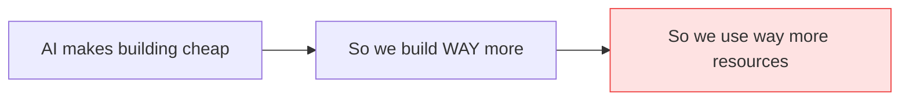
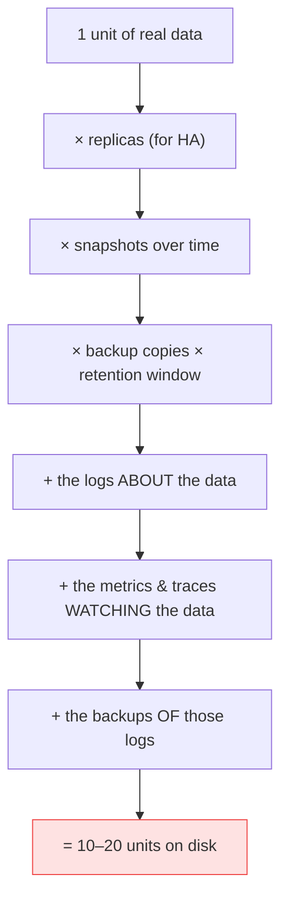
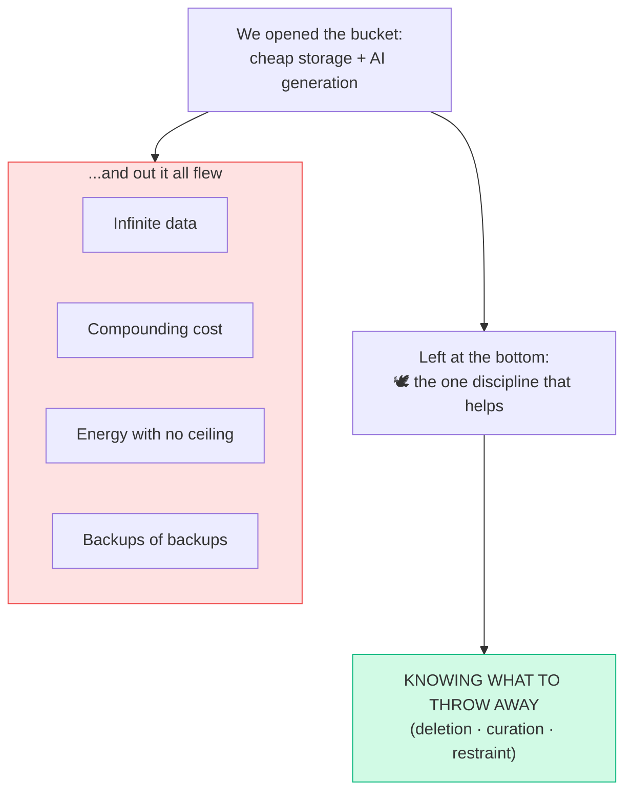

# Pandora's Bucket

> **What everyone "knows":** *AI makes us efficient. We build systems faster, cleaner,
> smarter — so surely we'll use fewer resources, not more.*
>
> **What actually happens:** cheaper *never* means less. Make creation almost free and you
> don't get a tidy, efficient world — you get an open jar that won't close, a storage bill
> that compounds forever, and the slow realization that the scarce skill was never *building*.
> It was knowing what to throw away.

*Part of a little series for people watching AI eat everything. This is the philosophical one —
half tech, half reflection. Title's a pun on Pandora's box, and stick around for the ending,
because the myth has a twist most people forget.*

---

## The scene that gave the whole thing away

We were about to move a pile of workloads to a region with **half-price electricity.** Smart
move, obviously — same machines, the power bill drops by half. Efficiency!

Then I caught myself drawing up the plan, and the plan said: *run more things there.* Of course
it did. Cheaper watts don't make you use less power — they make you greedy for power. The
rational response to "electricity is half price" is never "great, I'll spend half as much." It's
"great, I'll run twice as much for the same money."

That tiny self-own is this entire essay. So let me name what just happened, because it has a
name, and it's from 1865.

---

## Act I — The belief, and the man who killed it 160 years ago

Here's the comforting story, the one on every AI keynote slide:

In 1865, an economist named William Stanley Jevons looked at steam engines getting dramatically
more *fuel-efficient* and predicted, correctly, that Britain would burn **more** coal, not less.
Because efficiency made coal-power cheaper, so everyone used more of it. Net consumption went
*up.* They named it the **Jevons paradox**, and it has been quietly winning arguments ever
since.

**AI is Jevons for software.** It makes *building systems* radically cheap — so we build far
more of them, and everything downstream of "more systems" scales with it. The efficiency didn't
shrink consumption. It unleashed it. That slide should read:

You see it the instant you look at the storage. Backups fill faster. Object storage fills faster.
Not because anything got wasteful — because *there's simply more of everything,* faster.

---

## Act II — Why the jar fills faster than you'd ever expect

Here's the part that turns "more" into "oh no." Data doesn't grow one-for-one with the systems
you build. One unit of real data is never one unit on a disk — it walks through a multiplier:

So a 2× increase in *systems* can be a 10–20× increase in *stored bytes.* Backups and object
storage feel like they're filling fastest because they sit at the **multiplied end** of the
chain. You didn't double your data. You doubled the thing that gets multiplied by everything
else.

> 🤓 *Nerds, this part's for you:* and the cruel twist is that AI isn't just the *accelerant* —
> it's a *source.* AI systems generate their own exhaust just by existing: embeddings, vector
> indexes, eval and trace logs, synthetic data, model outputs, per-user observability on every
> single request. And we keep all of it, because "we might train on it" or "we might need to
> debug it." So the thing filling the jar is also drinking from it. The snake eats its tail, and
> the tail is in cold storage at $0.02/GB/month, forever.

---

## Act III — "But we'll just optimize," and why that's a trap with a trapdoor

This is where a smart person pushes back — and they should, because the pushback is *almost*
right. *Surely,* they say, *people will ask the AI to optimize per byte. Maybe 1% of teams
today, 20% in ten years. Those teams will shrink their footprint.*

Two true things, and one that ruins it.

**True thing one:** the optimizers will absolutely win — *for themselves.* They'll have cheaper
invoices, fatter margins, a real moat. Optimizing is a great business decision.

**True thing two:** it won't bend the curve. Aggregate consumption is set by the *price-
insensitive majority* plus all the new demand AI keeps inventing. The optimizers are a rounding
error against that. So: **optimize because it's your margin, not because it'll save the system.
It won't. It'll save yours.**

**The thing that ruins it:** optimization is itself *price-gated.* People don't adopt the
optimizations that already exist — look at how few teams use the context and caching tricks
that have been available for years — because optimizing *costs effort,* and while the resource
is cheap, it's perfectly rational not to bother.

The same cheapness that triggers the paradox also *suppresses the optimization that would fight
it.* It's a flywheel, not a brake.

And here's the trapdoor under the trap. "We'll have AI do the optimizing for free" feels like the
escape — it attacks the effort-cost directly. But **free optimization doesn't escape Jevons; it
pours gasoline on it.** Effortless efficiency just drops the effective price *further,* inviting
*more.* Worse — the *effort* of optimizing used to be a quiet brake all by itself. Optimization-
as-discipline worked partly *because it was hard;* the friction gated consumption. Make it
frictionless and you've removed the last pedal that was slowing the car. The AI that fills the
bucket, sold to you as the mop, now offers to make the mop free — and the bucket fills faster.

---

## Act IV — So how far does this go?

It goes until it hits something efficiency *cannot dissolve.* Jevons only wins while price isn't
the binding constraint, and right now nothing binds — compute and storage are cheap and the
appetite is bottomless. But the walls are real, and there are only a few of them:

- **Energy and carbon.** Underneath every byte is a watt. At civilization scale the ceiling
  isn't disk, it's power and the cost of the heat. (See: a region with half-price electricity,
  and what I immediately wanted to do with it.)
- **A hard budget or a regulation.** The moment you genuinely *can't* buy more, efficiency stops
  becoming "more units" and starts becoming "more work per unit." A cap is the only thing that
  reliably bends the curve, because a cap is the one thing efficiency can't optimize away.
- **Deletion by choice.** The voluntary version of a cap. Not a clever compression — an actual
  decision that some data isn't worth keeping.

And notice what *won't* save us: being smarter, faster, or more efficient. Those are the gas
pedal. The brake is a different kind of thing entirely — it's a *constraint,* something you
impose from outside the system because you decided to, not something you compute your way into.

When the wall finally binds — and it will, because exponentials always meet a wall — your
1%-becomes-20% optimizer curve won't climb because people got wise. It'll climb because the
resource finally got *expensive enough to hurt.* The early optimizers will look like prophets.
They weren't. They were just early to a wall everyone eventually hits. (This is the oldest story
in tech, by the way — Wirth's Law, "what Andy giveth, Bill taketh away"; or every highway
engineer who's learned that adding a lane just adds traffic. New substrate, ancient paradox.)

---

## What was at the bottom of the jar

Here's the part of the myth everyone forgets. Pandora opened the jar and every evil flew out
into the world — and then she slammed the lid, and trapped one single thing inside before it
could escape.

**Hope.**

Our bucket is the same shape. We opened it — cheap storage, infinite generation, frictionless
creation — and out flew everything: runaway data, compounding cost, energy we can't account for,
backups of backups of logs about backups. That's all loose in the world now and it isn't going
back in.

The thing still sitting at the bottom — the only thing that actually helps — isn't a better
algorithm or a cheaper region or a smarter model. It's **judgment about what's worth keeping.**
Retention by value, not by habit. Ephemeral by default, persist by exception. A `TTL` on the
log, a quiet `/dev/null` for the data that was never going to be read again, the discipline to
ask "do we need this?" before "where do we store this?"

In an age where *making* things is free, the scarce and valuable skill stops being production —
and stops being even optimization — and becomes **curation.** Deciding what gets to exist. That's
the hope at the bottom of the bucket, and the good news is the same AI that filled the jar is
also, finally, the best tool we've ever had for the other job: turning ten thousand logs into one
insight, summarizing instead of storing, compressing *meaning* instead of bytes. The cure and the
disease are the same technology. Whoever points it at *pruning* instead of only generating is the
one who gets out of the loop.

---

## The takeaways

1. **Cheaper never means less.** Efficiency unleashes consumption — it doesn't reduce it. Jevons
   was right in 1865 and he's right about your AI bill. Plan for the rebound, not the saving.
2. **Data grows multiplicatively, and AI is also a source.** One byte becomes ten or twenty once
   you count replicas, retention, logs, and observation — and AI generates its own exhaust on
   top. The jar fills far faster than your intuition says.
3. **Optimization is a personal moat, not a system fix** — and it's price-gated, so cheapness
   suppresses the very discipline that would fight it. Free, AI-driven optimization speeds the
   paradox up, it doesn't escape it.
4. **Only a constraint efficiency can't dissolve bends the curve:** energy, a budget,
   regulation, or deletion-by-choice. The brake is something you *impose,* not something you
   compute.
5. **In a world of free creation, curation is the scarce skill.** The hope at the bottom of the
   bucket is knowing what to throw away — and that's the one job worth pointing the AI at next.

We spent the whole history of computing learning how to *make* things. AI just made that nearly
free, and handed us the opposite problem, gift-wrapped: a jar that won't close and a bill that
won't stop. The way out isn't building faster. It's the small, unglamorous, deeply un-2026
courage to look at something you *could* keep, forever, for almost nothing — and delete it.

---

*This closes the series, for now. Start over at the [index](README.md) — from which GPU to buy,
all the way to what not to keep.*
